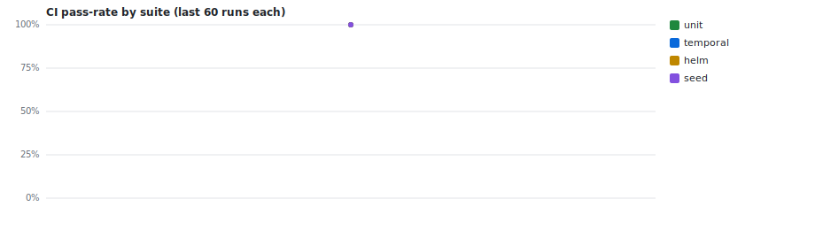
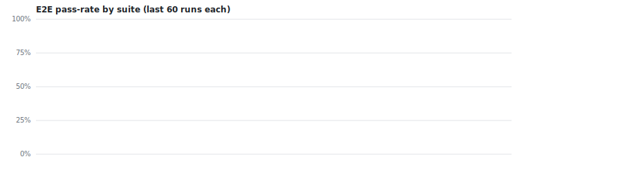
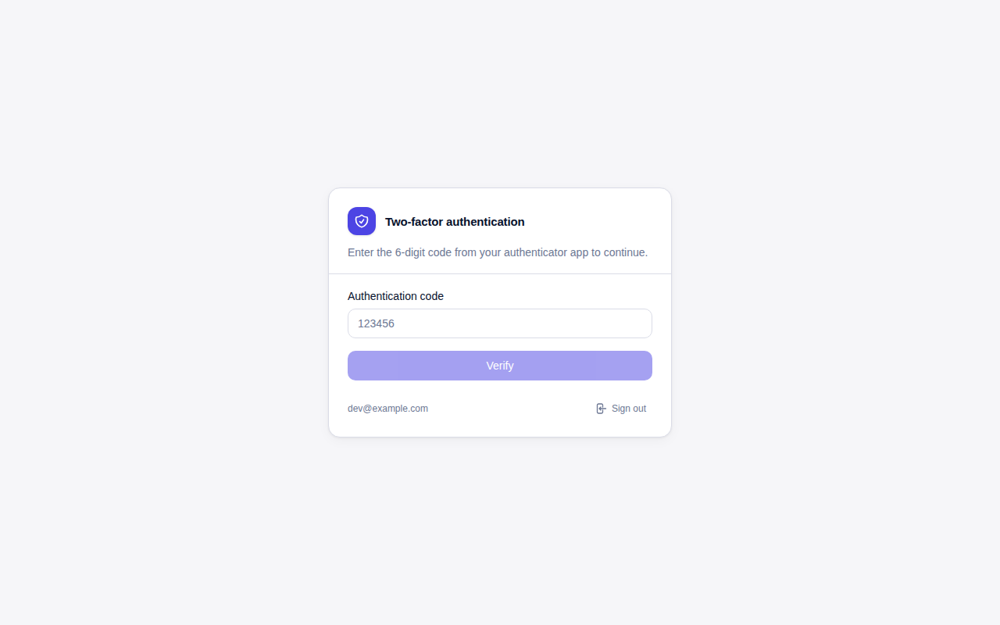
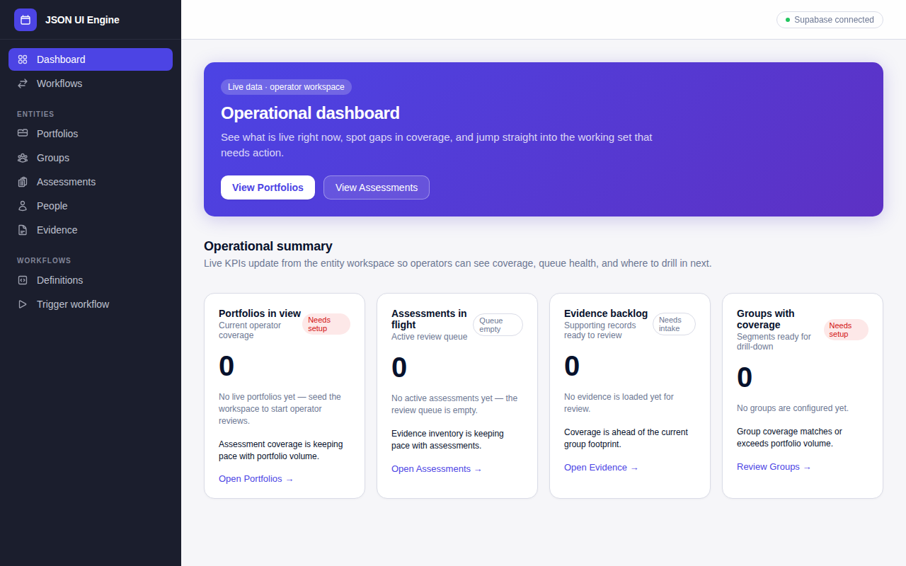

# Project Template — App Stack + GitHub Factory

[](https://github.com/Volaris-AI/project-template/actions/workflows/pr-validation.yml)
[](https://github.com/Volaris-AI/project-template/actions/workflows/e2e-dev.yml)
[](https://github.com/Volaris-AI/project-template/actions/workflows/e2e-aws.yml)
[](#license)

Project Template is a production-ready starting point for teams building AI-powered applications on a modern product stack: a React frontend with a JSON-driven UI engine, Supabase for auth and data, a Temporal worker for long-running workflows, and Kubernetes-ready deployment assets.

What makes this repository distinctive is that it ships **the product stack and the factory that builds it**. The GitHub factory pipeline continuously triages issues, assigns ready work to GitHub Copilot, reviews pull requests with specialist agents, monitors runtime signals, and keeps documentation, quality, and operations lanes moving on schedule.

It is designed for teams that want a reusable template rather than a toy demo: local Docker workflows, Supabase schema conventions, Helm charts, Terraform-oriented deployment docs, and an opinionated autonomous delivery pipeline are all included from day one.

## Vision

This repository exists to give teams a durable, reusable foundation for building and operating AI-native products without losing architectural intent as the project scales. For the full north-star principles that govern all decisions, read [`docs/vision.md`](docs/vision.md).

## Table of contents

- [Engineering health](#engineering-health)
- [What this is](#what-this-is)
- [Architecture overview](#architecture-overview)
- [Demo](#demo)
- [The factory pipeline](#the-factory-pipeline)
  - [Pipeline cadences](#pipeline-cadences)
  - [Agent roster](#agent-roster)
  - [Developer documentation](#developer-documentation)
  - [DevSecOps documentation](#devsecops-documentation)
  - [Workflow map](#workflow-map)
- [Stack components](#stack-components)
- [Getting started](#getting-started)
  - [Prerequisites](#prerequisites)
  - [Quick start](#quick-start)
  - [Local Kubernetes dry-run (Docker Desktop)](#local-kubernetes-dry-run-docker-desktop)
  - [First login](#first-login)
  - [Factory activation](#factory-activation)
- [Deployment targets](#deployment-targets)
- [Documentation map](#documentation-map)
- [Contributing](#contributing)
- [Repository settings](#repository-settings)
- [Security & quality roadmap](#security--quality-roadmap)
- [License](#license)

## Engineering health

| | |
|---|---|
|  |  |

Full dashboard: [`docs/ci-status/summary.md`](./docs/ci-status/summary.md)

## What this is

- **Problem it solves:** gives a new product team a coherent full-stack baseline instead of asking them to assemble frontend, auth, workflow orchestration, deployment, and delivery automation from scratch.
- **Who it is for:** teams building AI-powered apps on this stack who want both application scaffolding and an opinionated delivery operating model.
- **What makes it distinctive:** the autonomous GitHub factory pipeline, the JSON-driven UI engine in `frontend/src/engine/`, and production-oriented Kubernetes/Helm deployment assets for local Docker, Azure AKS, and AWS EKS targets.

## Architecture overview

```text
                           GitHub Factory
        Issues -> triage -> Copilot -> PR review -> merge -> deploy
                                  |
                                  v
Users <-> Frontend (React/Vite) <-> Supabase (Auth + Postgres + RLS)
                                  ^
                                  |
                     Temporal worker (TypeScript activities/workflows)
```

| Layer | Technology |
|---|---|
| Frontend | React + Vite, JSON-driven UI engine, TanStack Router + Query, Radix UI, Tailwind |
| Auth | Supabase Auth (self-hosted), SECURITY DEFINER RPCs for writes, RLS for reads |
| Database | Supabase Postgres, additive migrations, SCD2 entity versioning |
| Workflows | Temporal, TypeScript worker runtime in `temporal/` (`node dist/worker.js`), signal-driven human-in-the-loop approvals |
| Deploy | Helm chart, per-environment value profiles (dev/test/prod), Terraform-documented targets |
| Factory | GitHub Actions pipeline, Copilot SDK agents, label-driven routing |

For cross-cutting diagrams and subsystem views, start with [`docs/architecture/`](docs/architecture/README.md). For the binding decision log behind those choices, use [`docs/adrs/README.md`](docs/adrs/README.md).

## Demo


*Login with Supabase Auth — MFA enforced on every sign-in.*


*JSON-driven UI engine rendering a configuration-driven screen — the full dashboard layout is defined in a single JSON file.*

## Documentation

| Document | What it covers |
|---|---|
| [`docs/architecture/`](docs/architecture/) | Cross-cutting architecture diagrams and container-level views |
| [`docs/adrs/`](docs/adrs/) | Architecture Decision Records — why each significant decision was made |
| [`docs/specs/`](docs/specs/) | Detailed technical designs for individual features |
| [`docs/user-guide/`](docs/user-guide/) | Task-oriented how-to guides for end users |
| [`docs/testing.md`](docs/testing.md) | Testing strategy and test pyramid overview |
| [`AGENTS.md`](AGENTS.md) | Repository guidelines for AI coding agents |
| [`DATABASE.md`](DATABASE.md) | SCD2 schema conventions and database guide |
| [`Generalisable_schema.md`](Generalisable_schema.md) | Analytics facts and time-series schema extension guide |
| [`Guide_for_agents_using_supabase_template.md`](Guide_for_agents_using_supabase_template.md) | Agent instructions for working with the Supabase template |
| [`doc_templates/`](doc_templates/) | Reusable documentation templates (API, database, runbook, etc.) |
| [`.github/copilot-instructions.md`](.github/copilot-instructions.md) | Copilot implementation rules and factory workflow |
| [`.github/FACTORY-ACTIVATION.md`](.github/FACTORY-ACTIVATION.md) | Step-by-step guide to activating the GitHub factory pipeline |

## The factory pipeline

The factory turns repository issues into merged code. A typical path is: an issue is opened, the **product-owner** triages and labels it, the **project-manager** assigns GitHub Copilot when capacity is available, Copilot opens a draft PR, the **pr-handler** reviews and readies it, and specialist reviewers such as **database-steward**, **security-reviewer**, or **platform-engineer** are invoked only when the labels say they are needed. Supporting workflows also monitor Actions failures, deploy regressions, security findings, and documentation drift.

### Pipeline cadences

| Cadence | Schedule | Primary workflows | Typical responsibility |
|---|---|---|---|
| Fast | Every 15 minutes | [`pipeline-fast.yml`](.github/workflows/pipeline-fast.yml), [`monitor-actions.yml`](.github/workflows/monitor-actions.yml) | Triage, assignment, PR handling, and immediate incident/watchdog loops |
| Hourly | Hourly (`:17` / `:30`) | [`pipeline-hourly.yml`](.github/workflows/pipeline-hourly.yml), [`e2e-dev.yml`](.github/workflows/e2e-dev.yml) | Architecture shaping, QA review, ops review, and live-environment validation |
| Daily | 03:00, 04:00, 06:00 UTC | [`pipeline-daily.yml`](.github/workflows/pipeline-daily.yml), [`code-quality.yml`](.github/workflows/code-quality.yml), [`audit-cis-kubernetes.yml`](.github/workflows/audit-cis-kubernetes.yml), [`audit-azure-security.yml`](.github/workflows/audit-azure-security.yml), [`architecture-audit.yml`](.github/workflows/architecture-audit.yml) | Documentation upkeep, quality/security auditing, and scheduled architecture reviews |
| Nightly | 22:00 UTC | [`pipeline-nightly-devdocs.yml`](.github/workflows/pipeline-nightly-devdocs.yml) | Developer documentation coverage tracking and bootstrap ticketing for `docs/developer/` |
| Weekly | Monday 05:00 UTC (`refresh-azure-frontdoor-cidrs`), Monday 09:00 UTC (`pipeline-weekly`), Friday 18:00 UTC (`pipeline-weekly-diary`) | [`refresh-azure-frontdoor-cidrs.yml`](.github/workflows/refresh-azure-frontdoor-cidrs.yml), [`pipeline-weekly.yml`](.github/workflows/pipeline-weekly.yml), [`pipeline-weekly-diary.yml`](.github/workflows/pipeline-weekly-diary.yml) | Infra housekeeping, persona curation, and weekly operating summaries |
| Nightly | 22:00 UTC (`pipeline-nightly-devdocs`), 23:00 UTC (`pipeline-nightly-devsecops-docs`) | [`pipeline-nightly-devdocs.yml`](.github/workflows/pipeline-nightly-devdocs.yml), [`pipeline-nightly-devsecops-docs.yml`](.github/workflows/pipeline-nightly-devsecops-docs.yml) | Developer and DevSecOps documentation gap detection and bootstrap |

The active workflow catalog lives in [`.github/workflows/WORKFLOWS.md`](.github/workflows/WORKFLOWS.md). For a narrative description of the issue → PR → merge lifecycle, see [`docs/architecture/software-factory.md`](docs/architecture/software-factory.md). For current ghost-assignment diagnosis and cleanup guidance, see [`docs/specs/copilot-assignment-cleanup.md`](docs/specs/copilot-assignment-cleanup.md).

### Agent roster

| Agent | Purpose | File |
|---|---|---|
| `actions-monitor` | Investigates GitHub Actions failures, classifies root causes, and raises deduplicated incident issues. | [`actions-monitor.agent.md`](.github/agents/actions-monitor.agent.md) |
| `audit-findings-triage` | Groups structured audit findings into actionable, deduplicated security/platform issues. | [`audit-findings-triage.agent.md`](.github/agents/audit-findings-triage.agent.md) |
| `board-steward` | Repairs project-board hierarchy gaps and missing metadata fields. | [`board-steward.agent.md`](.github/agents/board-steward.agent.md) |
| `cluster-guardian` | Watches namespace health in read-only mode and files `auto:cluster` issues. | [`cluster-guardian.agent.md`](.github/agents/cluster-guardian.agent.md) |
| `cluster-remediator` | Performs maintainer-approved namespace-scoped runtime remediation. | [`cluster-remediator.agent.md`](.github/agents/cluster-remediator.agent.md) |
| `code-quality-reviewer` | Triages nightly static-analysis findings and files deduplicated quality work. | [`code-quality-reviewer.agent.md`](.github/agents/code-quality-reviewer.agent.md) |
| `database-steward` | Reviews Supabase migrations, RLS, tenant scoping, and seed-data safety. | [`database-steward.agent.md`](.github/agents/database-steward.agent.md) |
| `deploy-sentinel` | Investigates failed deploy or E2E runs and guarantees a critical incident is raised. | [`deploy-sentinel.agent.md`](.github/agents/deploy-sentinel.agent.md) |
| `diary-agent` | Writes the weekly factory diary summarising shipped work and operational observations. | [`diary-agent.agent.md`](.github/agents/diary-agent.agent.md) |
| `developer-docs-manager` | Maintains `docs/developer/` coverage by filing bootstrap and steady-state gap tickets. | [`developer-docs-manager.agent.md`](.github/agents/developer-docs-manager.agent.md) |
| `docs-improver` | Detects repeated documentation gaps and files targeted doc issues. | [`docs-improver.agent.md`](.github/agents/docs-improver.agent.md) |
| `factory-architect` | Converts product requests and vague epics into implementation-ready specs and ADRs. | [`factory-architect.agent.md`](.github/agents/factory-architect.agent.md) |
| `factory-process-reviewer` | Reviews recurring PR-process patterns and improves Copilot instructions when warranted. | [`factory-process-reviewer.agent.md`](.github/agents/factory-process-reviewer.agent.md) |
| `operations-manager` | Owns `queue:ops` for environment health, cost/security posture, and conservative ops work. | [`operations-manager.agent.md`](.github/agents/operations-manager.agent.md) |
| `personas-curator` | Maintains living product persona documents under `docs/personas/`. | [`personas-curator.agent.md`](.github/agents/personas-curator.agent.md) |
| `platform-engineer` | Owns CI, workflows, charts, runners, deploy-path, and developer-experience review lanes. | [`platform-engineer.agent.md`](.github/agents/platform-engineer.agent.md) |
| `pr-handler` | Handles one pull request end-to-end: review, triage, conflict/CI handling, and merge. | [`pr-handler.agent.md`](.github/agents/pr-handler.agent.md) |
| `product-owner` | Triages issues, prioritises the backlog, and maintains the GitHub Project hierarchy. | [`product-owner.agent.md`](.github/agents/product-owner.agent.md) |
| `project-manager` | Assigns ready issues to Copilot, manages PR flow, and enforces concurrency limits. | [`project-manager.agent.md`](.github/agents/project-manager.agent.md) |
| `qa-manager` | Grows E2E coverage and reviews the deployed experience for real usability. | [`qa-manager.agent.md`](.github/agents/qa-manager.agent.md) |
| `security-reviewer` | Reviews auth, secrets, permissions, dependencies, and data-exposure risk. | [`security-reviewer.agent.md`](.github/agents/security-reviewer.agent.md) |
| `tech-reviewer` | Performs engineering-quality and merge-readiness review on open PRs. | [`tech-reviewer.agent.md`](.github/agents/tech-reviewer.agent.md) |
| `trend-analyst` | Finds recurring issue and incident trends, then files one deduplicated roll-up issue per trend. | [`trend-analyst.agent.md`](.github/agents/trend-analyst.agent.md) |
| `user-docs-manager` | Creates and refreshes end-user documentation under `docs/user-guide/`. | [`user-docs-manager.agent.md`](.github/agents/user-docs-manager.agent.md) |
| `developer-docs-manager` | Nightly review of merged PRs and system coverage; files tickets to create or refresh developer guides under `docs/developer/`. Bootstrap mode on first run. | [`developer-docs-manager.agent.md`](.github/agents/developer-docs-manager.agent.md) |
| `devsecops-docs-manager` | Nightly review of security/compliance/IaC changes; files tickets to create or refresh DevSecOps practitioner guides under `docs/devsecops/`. Bootstrap mode on first run. | [`devsecops-docs-manager.agent.md`](.github/agents/devsecops-docs-manager.agent.md) |

### Developer documentation

Developer how-to guides live under [`docs/developer/`](docs/developer/README.md). The `developer-docs-manager` agent runs nightly and files tickets for any missing or outdated coverage. On the first run against an empty folder it enters bootstrap mode and submits tickets for all major system areas. See [docs/developer/README.md](docs/developer/README.md) for the full guide index.

### DevSecOps documentation

Guides for DevSecOps practitioners — security engineers, platform engineers, and on-call operators — live under [`docs/devsecops/`](docs/devsecops/README.md). The `devsecops-docs-manager` agent runs nightly and files tickets for missing or outdated security, compliance, and infrastructure operations coverage. Guides are written from an operations lens ("what do I check, run, or configure?"), not a developer tutorial lens. See [docs/devsecops/README.md](docs/devsecops/README.md) for the full guide index.

> **Maintainer note:** Treat this table as a verified index of live `.github/workflows/` files, not a roadmap. Every row must point to an existing workflow file, and its trigger/cadence text must be copied from that workflow's current `on:` configuration.

### Workflow map

| Workflow | Trigger / cadence | Purpose |
|---|---|---|
| [`pipeline-fast.yml`](.github/workflows/pipeline-fast.yml) | Every 15 min; `workflow_dispatch` | Runs the fast factory loop: stale re-kick, PR handler, product owner, project manager, database steward, security reviewer, and platform engineer. |
| [`pipeline-hourly.yml`](.github/workflows/pipeline-hourly.yml) | Hourly at `:30` UTC; `workflow_dispatch` | Runs the hourly factory sweep: factory architect, QA manager, operations manager, and cluster guardian. |
| [`pipeline-daily.yml`](.github/workflows/pipeline-daily.yml) | Daily `06:00` UTC; `workflow_dispatch` | Runs the daily documentation sweep via docs-improver and user-docs-manager. |
| [`pipeline-nightly-devdocs.yml`](.github/workflows/pipeline-nightly-devdocs.yml) | Nightly `22:00` UTC; `workflow_dispatch` | Runs developer-docs-manager to bootstrap and maintain `docs/developer/` coverage tickets. |
| [`pipeline-weekly.yml`](.github/workflows/pipeline-weekly.yml) | Monday `09:00` UTC; `workflow_dispatch` | Runs the weekly personas-curator stage to maintain `docs/personas/` living persona documents. |
| [`pipeline-weekly-diary.yml`](.github/workflows/pipeline-weekly-diary.yml) | Friday `18:00` UTC; `workflow_dispatch` | Writes the weekly diary entry under `docs/diary/`. |
| [`pipeline-nightly-devsecops-docs.yml`](.github/workflows/pipeline-nightly-devsecops-docs.yml) | Nightly `23:00` UTC; `workflow_dispatch` | Nightly DevSecOps documentation review: bootstrap on empty `docs/devsecops/`, watermark-based gap detection for security/IaC/compliance changes. |
| [`pr-trusted-rerun.yml`](.github/workflows/pr-trusted-rerun.yml) | `workflow_dispatch` with `pull_request_number` | Maintainer backstop for same-repo Copilot PRs: re-runs `action_required` PR workflows for the current PR head SHA without needing a speculative push. |
| [`pr-validation.yml`](.github/workflows/pr-validation.yml) | `pull_request` / `push` to `main` | Runs the main PR gates: frontend lint + build, Temporal lint + typecheck, DSL validation, and Helm render. |
| [`pr-enrichment.yml`](.github/workflows/pr-enrichment.yml) | `pull_request` opened / synchronise / reopened | Adds context labels and links related issues to PRs. |
| [`semgrep.yml`](.github/workflows/semgrep.yml) | `pull_request` / `push` to `main` | Runs Semgrep scans, uploads SARIF, and fails the check on ERROR-severity findings. |
| [`osv-scan.yml`](.github/workflows/osv-scan.yml) | `pull_request` to `main` | Runs OSV lockfile dependency scanning and fails when PR-introduced HIGH/CRITICAL vulnerabilities are detected. |
| [`gitleaks.yml`](.github/workflows/gitleaks.yml) | `pull_request` / `push` to `main` | Scans commit range for leaked secrets using Gitleaks; fails the check on any detected secret. |
| [`validate-dsl-definitions.yml`](.github/workflows/validate-dsl-definitions.yml) | PRs touching `temporal/definitions/**` | Validates DSL workflow definition JSON against the schema. |
| [`validate-ontology.yml`](.github/workflows/validate-ontology.yml) | PRs and `main` pushes touching Supabase SQL/seed paths | Enforces ontology and naming conventions on schema changes. |
| [`code-quality.yml`](.github/workflows/code-quality.yml) | Daily `04:00` UTC; `workflow_dispatch` | Runs deep non-gating static/security analysis, records quality metrics, and invokes `code-quality-reviewer` for deduplicated follow-up tickets. |
| [`build-images.yml`](.github/workflows/build-images.yml) | `pull_request`; `push` to `main` or `dev` | Builds and pushes frontend and worker images. |
| [`deploy-dev.yml`](.github/workflows/deploy-dev.yml) | After build-images on `main`/`dev`; `workflow_dispatch` | Deploys the selected image set into the dev Kubernetes namespace, optionally bootstrapping the DB. |
| [`deploy-test.yml`](.github/workflows/deploy-test.yml) | `workflow_dispatch` | Manually promotes a built image set into the test namespace. |
| [`deploy-prod.yml`](.github/workflows/deploy-prod.yml) | `workflow_dispatch` | Manually promotes a built image set into the production namespace. |
| [`monitor-actions.yml`](.github/workflows/monitor-actions.yml) | Every 15 min; `workflow_dispatch` | Detects stuck or failed workflow runs and files deduplicated incident issues. |
| [`monitor-deploy.yml`](.github/workflows/monitor-deploy.yml) | After dev deploy or E2E runs; `workflow_dispatch` | Investigates failed deploys or live-environment test runs. |
| [`audit-cis-kubernetes.yml`](.github/workflows/audit-cis-kubernetes.yml) | Nightly `03:00` UTC; `workflow_dispatch` | Runs kube-bench against the cluster and files issues for CIS failures. |
| [`audit-azure-security.yml`](.github/workflows/audit-azure-security.yml) | Nightly `04:00` UTC; `workflow_dispatch` | Runs Prowler/Azure security checks and files issues for findings. |
| [`container-scan-scheduled.yml`](.github/workflows/container-scan-scheduled.yml) | Weekly Monday `06:00` UTC; `workflow_dispatch` | Scans container images in ACR for HIGH/CRITICAL CVEs and misconfigurations using Trivy; files a deduplicated security issue on findings. |
| [`architecture-audit.yml`](.github/workflows/architecture-audit.yml) | Daily `06:00` UTC; `workflow_dispatch`; selected PRs | Runs a report-only whole-repo architecture audit across key code and control-plane paths. |
| [`k8s-render-validate.yml`](.github/workflows/k8s-render-validate.yml) | PRs or pushes touching chart / k8s deploy paths | Renders Helm templates and schema-validates the result. |
| [`refresh-azure-frontdoor-cidrs.yml`](.github/workflows/refresh-azure-frontdoor-cidrs.yml) | Weekly Monday `05:00` UTC; `workflow_dispatch` | Refreshes Azure Front Door backend CIDRs and opens/updates an automation PR when needed. |
| [`e2e-dev.yml`](.github/workflows/e2e-dev.yml) | Hourly at `:17`; `workflow_dispatch`; after dev deploy | Runs the full Playwright suite against the live dev environment. |
| [`e2e-aws.yml`](.github/workflows/e2e-aws.yml) | Hourly at `:47`; `workflow_dispatch`; after AWS dev deploy | Runs the full Playwright suite against the live AWS (CloudFront) environment. |

To activate the factory in a new fork, follow [`.github/FACTORY-ACTIVATION.md`](.github/FACTORY-ACTIVATION.md).

## Stack components

### Frontend

- `frontend/` contains a Vite + React application with TanStack Router and TanStack Query.
- The JSON-driven UI engine lives under [`frontend/src/engine/`](frontend/src/engine/) and is the main extension point for configuration-driven screens.
- Radix UI and Tailwind provide the component foundation.

### Auth & database

- Supabase provides self-hosted auth, Postgres, REST, and storage services.
- Reads are governed with RLS; authenticated writes route through SECURITY DEFINER RPCs.
- The data model uses additive migrations and SCD2 versioning conventions. Start with [`DATABASE.md`](DATABASE.md) and [`Guide_for_agents_using_supabase_template.md`](Guide_for_agents_using_supabase_template.md).

### Workflows

- `temporal/` contains the Temporal worker and workflow runtime.
- Long-running or human-in-the-loop business processes are expected to live here.
- For implementation and orchestration decisions, see [`docs/adrs/0006-temporal-workflow-orchestration.md`](docs/adrs/0006-temporal-workflow-orchestration.md) and [`docs/adrs/0007-temporal-signal-driven-human-in-the-loop.md`](docs/adrs/0007-temporal-signal-driven-human-in-the-loop.md).

### Deployment

- Local development runs with Supabase CLI plus Docker Compose wrappers (`make up`, `make up-https`).
- Kubernetes deployment is centered on [`charts/app/`](charts/app/), with supporting charts in [`charts/temporal/`](charts/temporal/) and [`charts/supabase/`](charts/supabase/).
- The three documented targets are local Docker, Azure AKS, and AWS EKS. See [`docs/specs/platform-deployment-spec.md`](docs/specs/platform-deployment-spec.md) for the deployment contract and the `terraform/` layout described there.

### Developer documentation

- Contributor-facing guides are indexed under [`docs/developer/README.md`](docs/developer/README.md).
- The `developer-docs-manager` nightly pipeline tracks coverage and opens deduplicated tickets when guide areas are missing.

## Getting started

### Prerequisites

- Docker Desktop with Compose v2
- `make` (comes with macOS/Linux; install via Xcode CLT on macOS)
- **Supabase CLI** — required; `make up` runs `supabase start` to launch the local Supabase stack
- Node 18+ (optional for running the frontend outside Docker)

### Quick start

```bash
cp .env.example .env
make setup   # install git hooks (lefthook + gitleaks) and npm deps — run once after cloning
make up
# or: make up-https  # single HTTPS entrypoint via Traefik on https://localhost
```

Add `USE_DEV=1` for live-reload mounts. `make up` runs `supabase start` (Postgres + API + Auth, with migrations and seed applied), then brings up Temporal, the worker, and the frontend.

By default, `docker-compose.yml` reads `.env.temporal.example`, which mirrors the dev K8s naming convention (`10x-stack-dev` / `10x-stack-dev-main`). For classic local-only Temporal naming, create `.env.temporal` and set:

```bash
TEMPORAL_NAMESPACE=default
TEMPORAL_TASK_QUEUE=main
```

### Local license audits

Use the workspace-level license summary command for quick local checks:

```bash
npm --prefix frontend run licenses
npm --prefix temporal run licenses
```

For the SPDX allowlist enforcement used by CI and hooks, run:

```bash
npm --prefix frontend run licenses:check
npm --prefix temporal run licenses:check
```

**Services:**
| Service | URL |
|---|---|
| Frontend | http://localhost:3000 |
| Temporal Workflow API | http://localhost:3001 |
| Temporal UI | http://localhost:8081 |
| Supabase API | http://localhost:54321 |

`docker-compose.yml` publishes direct app service ports on loopback only (`127.0.0.1`) for local development, so they are reachable from the host machine but not exposed to your LAN.

### HTTPS overlay (`make up-https`)

| Service | URL |
|---|---|
| Frontend | https://localhost |
| Temporal UI | https://localhost/temporal |
| Supabase REST | https://localhost/rest/v1 |
| Supabase Auth | https://localhost/auth/v1 |

`make up-https` uses a local Traefik proxy (`127.0.0.1:443`) and auto-generates a self-signed cert in `certs/local/` on first run.
On first visit, your browser will show a certificate warning. Use the browser's “Proceed/Accept” action once for `https://localhost`.
Optional trusted local cert (ADR-0048): `brew install mkcert && mkcert -install`, then run:

```bash
mkcert -cert-file certs/local/cert.pem -key-file certs/local/key.pem localhost 127.0.0.1 ::1
```

> **Supabase Studio is disabled by default.** It has no authentication — anyone who can reach the port gets full database admin access. Use `make bootstrap-users` to create dev users instead. To re-enable temporarily for local schema exploration: set `enabled = true` in `supabase/config.toml`, run `supabase stop && supabase start`, and re-disable when done.

### Optional: HTTPS local development

Run `make up-https` instead of `make up` to start the stack behind a Traefik TLS-terminating proxy on `127.0.0.1:443`. Certificates are generated automatically on first run — no host tools required.

```bash
make up-https
```

**HTTPS services (single entry point on `https://localhost`):**
| Path | Service |
|---|---|
| `https://localhost` | Frontend |
| `https://localhost/temporal` | Temporal UI |
| `https://localhost/rest/v1` | Supabase REST API |
| `https://localhost/auth/v1` | Supabase Auth |
| `https://localhost/storage/v1` | Supabase Storage |

HTTP requests to `http://localhost` redirect automatically to HTTPS.

**One-time certificate trust step:** The certificate is self-signed and stored in `certs/local/` (git-ignored — never committed). Your browser will show a security warning on first visit:
- **Chrome/Edge:** *Advanced → Proceed to localhost (unsafe)*
- **Firefox:** *Advanced → Accept the Risk and Continue*
- **Safari:** *Show Details → visit this website*

Click through once per browser and the warning will not reappear until the certificate is regenerated.

To regenerate the certificate manually (e.g. after deleting `certs/local/`):
```bash
make certs   # writes certs/local/cert.pem and certs/local/key.pem
```

The original `make up` flow (HTTP, no proxy) continues to work unchanged.

**Common commands:**
```bash
make down             # stop all services
make reset            # tear down volumes, recreate and re-apply migrations
make logs             # stream all service logs
make supabase-status  # show Supabase URLs and local keys
make certs            # generate/re-generate local TLS certs for make up-https
```

Having trouble? See [`docs/troubleshooting.md`](docs/troubleshooting.md) for solutions to common Docker, MFA, HTTPS, Temporal, and CI issues.

### Local Kubernetes dry-run (Docker Desktop)

If you want to test Kubernetes manifests locally before pushing to AKS or EKS, use the `values-local-k8s.yaml` overlay with Docker Desktop's built-in Kubernetes:

```bash
# 1. Enable Kubernetes in Docker Desktop → Settings → Kubernetes → Enable Kubernetes

# 2. Start the local Supabase stack (so host.docker.internal:54321 is reachable)
make up

# 3. Build images locally
docker build -t frontend:dev-latest -f frontend/Dockerfile .
docker build -t temporal-worker:dev-latest -f temporal/Dockerfile .

# 4. Create required Kubernetes Secrets
kubectl create secret generic frontend-secrets \
  --from-literal=VITE_SUPABASE_ANON_KEY=$(make supabase-status 2>/dev/null | grep anon | awk '{print $NF}')
kubectl create secret generic temporal-worker-secrets \
  --from-literal=SUPABASE_SERVICE_ROLE_KEY=<your-service-role-key-from-make-supabase-status>

# 5. Install with the local overlay (no cloud credentials required)
helm upgrade --install myapp charts/app -f charts/app/values-local-k8s.yaml

# 6. Access services
kubectl port-forward svc/myapp-app-frontend 3000:80      # frontend on http://localhost:3000
kubectl port-forward svc/myapp-app-ops-api 3001:8000     # ops API on http://localhost:3001
```

The local overlay sets `service.type: ClusterIP` (no cloud LoadBalancer), disables `ExternalSecret` resources (no ESO/OpenBao required), and routes Supabase traffic via `host.docker.internal:54321` to the locally-running Supabase stack. See [`charts/app/values-local-k8s.yaml`](charts/app/values-local-k8s.yaml) for the full overlay.

### First login

After `make up`, create local dev users:

```bash
make bootstrap-users
```

This creates (or resets) three dev accounts with known credentials and enrolls a TOTP factor for each:

| Role | Email | Password |
|---|---|---|
| Admin | `admin@dev.local` | `Admin1234!` |
| Editor | `editor@dev.local` | `Editor1234!` |
| Read-only | `readonly@dev.local` | `Readonly1234!` |

**MFA is enforced.** The script prints a `otpauth://` TOTP URI and the current 6-digit code for each user. Scan the URI into an authenticator app (Authy, 1Password, Google Authenticator) before logging in — the app's code is required on every sign-in.

Re-running `make bootstrap-users` resets all credentials and generates fresh TOTP secrets.

---

### Factory activation

This template ships with an autonomous factory pipeline. When activated, it:

1. **Triages issues** — labels, prioritises, and routes new issues every 15 minutes
2. **Assigns Copilot** — automatically assigns `ready-for-dev` issues to the GitHub Copilot coding agent
3. **Reviews PRs** — agents review code, request changes, and merge passing PRs
4. **Files incidents** — E2E smoke failures and deploy failures auto-create GitHub issues

### Required secrets

Set these two secrets on the repository to activate the factory:

| Secret | Purpose | Scopes needed |
|---|---|---|
| `COPILOT_TOKEN` | Authenticates the Copilot SDK agent runner | `repo`, `issues:write`, `pull-requests:write` — must belong to an account with GitHub Copilot for Business |
| `PROJECT_MANAGER_PAT` | `gh` CLI identity for pipeline operations (label edits, PR merges, incident filing) | `repo`, `issues:write`, `pull-requests:write` |

```bash
gh secret set COPILOT_TOKEN --repo <org>/<repo>
gh secret set PROJECT_MANAGER_PAT --repo <org>/<repo>
```

Without these secrets, all pipeline runs will complete as green but do nothing (the agent runner exits early with `"COPILOT_GITHUB_TOKEN not set — skipping"`).

### Required variable

```bash
gh variable set E2E_BASE_URL --repo <org>/<repo> --env dev --body "https://dev.yourapp.example.com"
```

Set this on the `dev` Actions environment. This is the URL the hourly E2E smoke suite runs against. Without it, E2E runs against a blank URL and files noisy incidents.

### Optional: E2E credentials

Once a dev environment is deployed, configure these secrets to enable authenticated E2E tests:

```
E2E_AUTH_EMAIL / E2E_AUTH_PASSWORD
E2E_READONLY_EMAIL / E2E_READONLY_PASSWORD
E2E_MANAGER_EMAIL / E2E_MANAGER_PASSWORD
E2E_OPERATOR_EMAIL / E2E_OPERATOR_PASSWORD
E2E_MFA_CODE (optional, only when the E2E account receives an MFA challenge)
```

> **Auth-absent behavior:** If `E2E_AUTH_EMAIL` is not configured, all auth-requiring tests intentionally skip via `test.skip()` guards. The skip budget is automatically relaxed to 100% in this case so CI passes cleanly with expected skips — no failure. Once auth credentials are added, the 25% skip budget is enforced again to catch accidental regressions.

### How to verify the factory is active

1. Open an issue with no labels.
2. Wait up to 15 minutes.
3. Confirm: the issue has `queue:development`, `ready-for-dev`, and `priority:*` labels.
4. Wait another 15 minutes.
5. Confirm: `copilot-swe-agent[bot]` is assigned and a draft PR has opened.

### Manually assigning Copilot to an issue

The factory's project-manager agent handles assignment automatically for `ready-for-dev` issues. To assign Copilot manually (e.g. to re-kick a stalled issue), replace `<owner>`, `<repo>`, and `<number>` with your values:

```bash
gh api repos/<owner>/<repo>/issues/<number>/assignees -X POST --field 'assignees[]=Copilot'
```

> **Note:** `gh issue edit --add-assignee Copilot` does not work — the CLI validates against the collaborators list. Use the REST one-liner above, or the `/assign-copilot` Claude slash command (`.claude/commands/assign-copilot.md`).

### Full activation guide

See [`.github/FACTORY-ACTIVATION.md`](.github/FACTORY-ACTIVATION.md) for the complete activation checklist, token requirements, and how the issue → Copilot → review → merge flow works.

## Deployment targets

| Target | Runtime shape | What to use |
|---|---|---|
| Local | Docker Desktop + Supabase CLI + Docker Compose | Use `make up` / `make up-https` for the full local stack. See [`docker-compose.yml`](docker-compose.yml) and [`docs/specs/platform-deployment-spec.md`](docs/specs/platform-deployment-spec.md). |
| Azure AKS | Shared AKS cluster `aks-selfheal-staging` in resource group `rg-selfheal-staging` (`eastus2`) | Use the Helm charts plus the Azure-oriented Terraform stack described in [`terraform/platform/azure-staging/`](terraform/platform/azure-staging/) and [`terraform/stacks/10x-stack-dev/`](terraform/stacks/10x-stack-dev/). |
| AWS EKS | Shared EKS target `dev-eks-cluster` (`us-east-1`) | Use the AWS-oriented Terraform and values layout described in [`terraform/platform/aws-staging/`](terraform/platform/aws-staging/) and [`terraform/stacks/10x-stack-aws-dev/`](terraform/stacks/10x-stack-aws-dev/). |

For the full deployment mental model, start with [`docs/specs/platform-deployment-spec.md`](docs/specs/platform-deployment-spec.md) and then drill into the relevant `terraform/` stack.

## Documentation map

| Area | Key documents | What they cover |
|---|---|---|
| Architecture overview | [`docs/architecture/README.md`](docs/architecture/README.md) | The shape of the whole system, cross-cutting diagrams, and where to go next for deeper subsystem views. |
| Architecture decisions | [`docs/adrs/README.md`](docs/adrs/README.md), [`docs/adrs/TEMPLATE.md`](docs/adrs/TEMPLATE.md) | Why significant choices were made, when to write a new ADR, and how decisions are indexed. |
| Technical specs | [`docs/specs/`](docs/specs/), [`docs/specs/platform-deployment-spec.md`](docs/specs/platform-deployment-spec.md), [`docs/specs/copilot-assignment-cleanup.md`](docs/specs/copilot-assignment-cleanup.md) | Slice-by-slice implementation designs, deployment contracts, and current factory reliability/cleanup work. |
| Agent guidelines | [`AGENTS.md`](AGENTS.md), [`.github/agents/`](.github/agents/) | Repository navigation, contribution expectations, and full instructions for each specialist factory agent. |
| Database conventions | [`DATABASE.md`](DATABASE.md), [`Guide_for_agents_using_supabase_template.md`](Guide_for_agents_using_supabase_template.md), [`Generalisable_schema.md`](Generalisable_schema.md) | The core schema, SCD2 conventions, entity/fact modelling, and extension guidance for Supabase-based products. |
| Factory instructions | [`.github/copilot-instructions.md`](.github/copilot-instructions.md), [`.github/FACTORY-ACTIVATION.md`](.github/FACTORY-ACTIVATION.md), [`.github/workflows/WORKFLOWS.md`](.github/workflows/WORKFLOWS.md) | How Copilot is expected to work in this repo, how to activate the factory, and what every active workflow does. |
| Contribution guide | [`CONTRIBUTING.md`](CONTRIBUTING.md) | How to open issues, keep PRs small, when ADRs are required, and what checks contributors are expected to run. |
| Troubleshooting | [`docs/troubleshooting.md`](docs/troubleshooting.md), [`docs/testing.md`](docs/testing.md) | Common local/CI failure modes and the testing strategy behind the available checks. |
| Templates | [`doc_templates/`](doc_templates/), [`doc_templates/ISSUE.md`](doc_templates/ISSUE.md) | Reusable doc templates plus the canonical issue format for human- and architect-authored tickets. |
| User guidance | [`docs/user-guide/`](docs/user-guide/) | Operator-facing task guides for features once they are implemented. |

## Repository settings

Use the following as a **recommended fork baseline**. GitHub does not copy these rules automatically when you fork this template, and the live settings in this repository can change over time.

### Branch protection (`main`)

| Rule | Recommended setting |
|---|---|
| Required approvals | 1 |
| Dismiss stale reviews on new push | enabled |
| Require CODEOWNERS review | enabled |
| Require approval of last push | enabled — prevents approve-then-sneak-change |
| Required status checks | `Summary` (must be up to date with `main` before merge) |
| Require linear history | enabled — squash-only, no merge commits |
| Enforce rules for administrators | enabled — no bypass |
| Restrict force pushes | blocked |
| Restrict branch deletion | blocked |
| Require conversation resolution | enabled |

Apply with:
```bash
gh api -X PUT repos/<org>/<repo>/branches/main/protection --input - <<'EOF'
{
  "required_status_checks": { "strict": true, "checks": [{"context": "Summary", "app_id": 15368}] },
  "enforce_admins": true,
  "required_pull_request_reviews": {
    "dismiss_stale_reviews": true,
    "require_code_owner_reviews": true,
    "require_last_push_approval": true,
    "required_approving_review_count": 1
  },
  "required_linear_history": true,
  "allow_force_pushes": false,
  "allow_deletions": false,
  "required_conversation_resolution": true,
  "restrictions": null
}
EOF
```

### Merge strategy

Only squash merges are permitted. Merge commits and rebase merges are disabled. This keeps `git log` on `main` linear and auditable — one commit per PR.

```bash
gh api -X PATCH repos/<org>/<repo> \
  --field allow_merge_commit=false \
  --field allow_rebase_merge=false \
  --field allow_squash_merge=true \
  --field delete_branch_on_merge=true \
  --field web_commit_signoff_required=true
```

### Actions permissions

`GITHUB_TOKEN` is read-only by default. Workflows that need write access must explicitly request it via `permissions:` in the workflow file. The Actions runner cannot approve pull requests.

```bash
gh api -X PUT repos/<org>/<repo>/actions/permissions/workflow \
  --field default_workflow_permissions=read \
  --field can_approve_pull_request_reviews=false
```

### Copilot and bot PR workflow approval

By default, GitHub requires approval before running Actions workflows on pull requests from GitHub Apps and bots — including the Copilot coding agent. Without this setting configured, every Copilot PR will show `action_required` on all PR checks instead of running them, which blocks the factory pipeline and generates repeated `ci-action-required-gate` ops alerts.

**Required:** Go to **Settings → Actions → General**, scroll to **"Fork pull request workflows from outside collaborators"**, open the **"Require approval for"** dropdown, and select **"All contributors"** (or "Known contributors who have previously committed to this repository" if you prefer a narrower grant). This allows the Copilot coding agent to trigger PR validation workflows automatically without requiring per-run maintainer approval.

The dropdown options and their API equivalents are:

| UI label | API value (`fork_pull_request_workflows_approval_policy`) |
|---|---|
| Require approval for all outside collaborators | `all_contributors` |
| Require approval for first-time contributors who are new to GitHub | `known_contributors` |
| Do not require approval for any contributors | `trusted_contributions` |

You can also configure this via the GitHub API:

```bash
# Org-level (applies to all repos in the org):
gh api -X PUT orgs/<org>/actions/permissions/workflow \
  --field fork_pull_request_workflows_approval_policy=trusted_contributions

# Repo-level (applies to this repo only):
gh api -X PUT repos/<org>/<repo>/actions/permissions/workflow \
  --field fork_pull_request_workflows_approval_policy=trusted_contributions
```

If a Copilot PR is already stuck at `action_required` after updating the setting:

1. Confirm the setting change is saved.
2. Have a repository maintainer open the PR and click **Re-run all jobs**, run `gh run rerun <run-id>` from a maintainer account for each blocked run, or dispatch the [`rerun-blocked-runs.yml`](.github/workflows/rerun-blocked-runs.yml) workflow with the PR's head SHA to rerun all blocked runs in one step.
3. `action_required` clears and normal PR checks proceed.

> **Note:** this is the single most common factory activation gap. If the factory is creating `ci-action-required-gate` incident issues repeatedly, this setting is almost always the root cause.

### Secret scanning

All secret scanning features are enabled: push protection blocks commits containing secrets, AI detection covers non-standard token formats, and validity checks confirm whether detected secrets are still active.

```bash
gh api -X PATCH repos/<org>/<repo> \
  --field 'security_and_analysis[secret_scanning][status]=enabled' \
  --field 'security_and_analysis[secret_scanning_push_protection][status]=enabled' \
  --field 'security_and_analysis[secret_scanning_ai_detection][status]=enabled' \
  --field 'security_and_analysis[secret_scanning_non_provider_patterns][status]=enabled' \
  --field 'security_and_analysis[secret_scanning_validity_checks][status]=enabled'
```

### CODEOWNERS

`.github/CODEOWNERS` requires human review for changes to the factory control plane, deploy RBAC, Helm chart templates, and ADRs. Any PR touching `.github/workflows/`, `.github/agents/`, `charts/app/templates/`, or `docs/adrs/` requires approval from `@ianreay` (replace with your own handle when forking).

### Other enabled security features

- Dependabot vulnerability alerts and automated security PRs
- Secret scanning with push protection
- Supply chain: SHA-pinning of all Actions references is tracked in issue #171

### Build image verification

`CICD - Build Images` signs pushed ACR image digests with Cosign keyless signing, uploads an SPDX SBOM artifact per image, and publishes SLSA provenance for each pushed digest.

Verify a signed image digest from this repository's build workflow:

```bash
cosign verify \
  --certificate-oidc-issuer https://token.actions.githubusercontent.com \
  --certificate-identity-regexp '^https://github.com/Volaris-AI/project-template/.github/workflows/build-images.yml@refs/heads/(main|dev)$' \
  acrselfhealstg.azurecr.io/frontend@sha256:<digest>
```

Verify the attached SLSA provenance attestation for the same digest:

```bash
cosign verify-attestation \
  --type slsaprovenance \
  --certificate-oidc-issuer https://token.actions.githubusercontent.com \
  --certificate-identity-regexp '^https://github.com/slsa-framework/slsa-github-generator/.github/workflows/generator_container_slsa3.yml@refs/tags/v2.1.0$' \
  acrselfhealstg.azurecr.io/frontend@sha256:<digest>
```

## Security & quality roadmap

All security hardening, quality gates, and platform reliability work is tracked in the **[Security & Quality Roadmap](https://github.com/orgs/Volaris-AI/projects/18)** (GitHub Project #18).

The board is organised as a three-level hierarchy:

```
Initiative #15 — Platform, security & delivery
├── Epic #38 — OSS security scanning (Semgrep, osv-scanner, Gitleaks, Trivy, license-checker)
├── Epic #50 — Container & image hardening (.dockerignore, multi-stage builds, hadolint)
├── Epic #52 — Secrets management (OpenBao + External Secrets Operator — ADR-0042)
├── Epic #53 — Supply chain integrity (SLSA provenance, SBOM, Cosign, SHA-pinned Actions)
├── Epic #51 — Kubernetes hardening (NetworkPolicy, ServiceAccounts, HPA, PDB)
├── Epic #55 — Code quality gates (coverage thresholds, typecheck pre-commit, linters)
├── Epic #54 — Observability stack (Grafana LGTM — Loki, Tempo, Mimir)
├── Epic #16 — CI validation stability
└── Epic #17 — Documentation foundations
```

### Board steward

The **board-steward** agent (`.github/agents/board-steward.agent.md`) automatically audits the project board for hierarchy gaps — orphaned issues, missing epic parents, duplicate epics, and missing Priority/Phase/Type fields. It runs as part of the hourly factory pipeline and can be invoked manually with `@copilot run board-steward`.

The **`/triage-board`** Claude Code skill (`.claude/commands/triage-board.md`) provides the same audit interactively from the CLI. Run it after any bulk issue creation to catch gaps immediately.

### Nightly security audits

Two nightly workflows run security audits against the live environment and automatically create GitHub issues for any findings:

| Workflow | Schedule | Tool | What it checks |
|---|---|---|---|
| `audit-cis-kubernetes.yml` | 03:00 UTC | kube-bench (Apache 2.0) | CIS Kubernetes Benchmark — node config, kubelet, network policies |
| `audit-azure-security.yml` | 04:00 UTC | Prowler (Apache 2.0) + Azure Defender | CIS Azure 2.0 — IAM, storage, networking, monitoring |

Both workflows require the self-hosted runner (`factory-cluster-guardian`) with cluster access (kube-bench) or Azure CLI credentials (Prowler). When the runner is unavailable they skip gracefully.

After each audit, the **audit-findings-triage** agent (`.github/agents/audit-findings-triage.agent.md`) reads the structured JSON output and:
- Groups related findings by root cause (avoids one-issue-per-check noise)
- Checks for existing open issues with matching fingerprints before filing
- Re-opens closed issues if a finding has recurred
- Assigns each new issue to the correct epic and project board with priority set
- Caps at 10 new issues per run, highest severity first

To trigger manually:
```bash
gh workflow run audit-cis-kubernetes.yml
gh workflow run audit-azure-security.yml
```

### Weekly Azure Front Door CIDR refresh

`refresh-azure-frontdoor-cidrs.yml` runs weekly (and supports `workflow_dispatch`) to regenerate `deploy/azure/afd-backend-cidrs.txt` from the `AzureFrontDoor.Backend` service tag and opens/updates an automation PR when the file changes.

Required configuration:

| Name | Type | Purpose |
|---|---|---|
| `AZURE_CLIENT_ID` | secret | Azure app registration/client ID for OIDC login |
| `AZURE_TENANT_ID` | secret | Azure Entra tenant ID |
| `AZURE_SUBSCRIPTION_ID` | secret | Azure subscription queried for service tags |
| `PROJECT_MANAGER_PAT` | secret | Required token for trusted PR-opening identity (`peter-evans/create-pull-request`) |
| `AZURE_SERVICE_TAGS_LOCATION` | variable (optional) | Azure region passed to `az network list-service-tags` (defaults to `eastus`) |

Failure mode:
- If required Azure secrets are missing, the workflow fails with explicit `::error::Missing required secret` entries in the Actions log and does not continue silently.
- If `PROJECT_MANAGER_PAT` is missing, the workflow fails before PR creation and does not fall back to `github.token`.

## Contributing

Read [`CONTRIBUTING.md`](CONTRIBUTING.md) before opening a PR. Key points:

- **Branch naming:** `feat/`, `fix/`, `docs/`, `chore/` prefixes matched to issue type.
- **PR size:** keep PRs small and single-purpose. One issue per PR is the default.
- **ADRs:** any change that alters a significant architectural choice requires a new ADR in `docs/adrs/`. See [`docs/adrs/TEMPLATE.md`](docs/adrs/TEMPLATE.md) and the guidance in [`.github/copilot-instructions.md`](.github/copilot-instructions.md).
- **Tests:** all PRs must include tests appropriate to the change — see [`docs/testing.md`](docs/testing.md) for the test pyramid.
- **Issue format:** use [`doc_templates/ISSUE.md`](doc_templates/ISSUE.md) as the canonical template for all human-authored tickets.
- **Factory:** the autonomous pipeline reviews every PR. Do not bypass CI gates or CODEOWNERS checks.

## License

This software is proprietary. Use is restricted exclusively to legal entities **wholly owned** (100%) by Constellation Software Inc. (TSX: CSU). Partial ownership, joint ventures, and minority investments do not qualify.

A `LICENSE` file in the repository root contains the full terms. This proprietary license text should be reviewed by qualified legal counsel.

> **If you are unsure whether your organisation qualifies as a wholly-owned CSI subsidiary, do not use this codebase until you have confirmed your status with CSI legal.**
