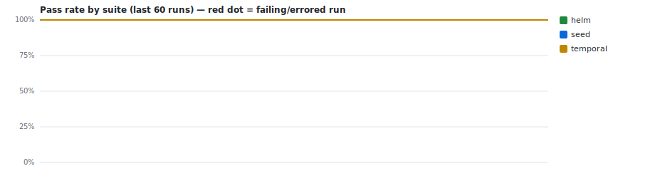

# CI test trends — `rodrigoreisdealernet/project-template`

> Auto-generated by **PR Validation** (`publish-test-history`). Do not edit by hand — every
> run regenerates this branch. The machine-readable source of truth is [`runs.jsonl`](./runs.jsonl).
> Deployed-environment E2E trends live separately on the [`e2e-history`](../../tree/e2e-history) branch.

**Last updated:** 2026-06-24 21:35Z · 28 records · suites: `helm`, `seed`, `coverage`, `temporal`



## Suites

| Suite | Latest | When (UTC) | Pass 24h | Pass 7d | Green streak | Runs |
|---|---|---|--:|--:|--:|--:|
| `helm` | ✅ `passed` [↗](https://github.com/rodrigoreisdealernet/project-template/actions/runs/28131101046) | — | — | — | 8 | 8 |
| `seed` | ✅ `passed` [↗](https://github.com/rodrigoreisdealernet/project-template/actions/runs/28131101046) | — | — | — | 8 | 8 |
| `coverage` | ✅ `passed` [↗](https://github.com/rodrigoreisdealernet/project-template/actions/runs/28131101046) | — | — | — | 4 | 4 |
| `temporal` | ✅ `passed` [↗](https://github.com/rodrigoreisdealernet/project-template/actions/runs/28131101046) | 2026-06-24 21:35Z | 100% (8) | 100% (8) | 8 | 8 |


## Recent runs

| When (UTC) | Suite | Result | Pass | Fail | Skip | Duration | Commit | Run |
|---|---|---|--:|--:|--:|--:|---|---|
| 2026-06-24 21:35Z | `temporal` | ✅ passed | 309 | 0 | 10 | 44.7s | `f86275b` | [#44](https://github.com/rodrigoreisdealernet/project-template/actions/runs/28131101046) |
| 2026-06-24 21:32Z | `temporal` | ✅ passed | 309 | 0 | 10 | 44.4s | `83fb07f` | [#43](https://github.com/rodrigoreisdealernet/project-template/actions/runs/28130936873) |
| 2026-06-24 20:58Z | `temporal` | ✅ passed | 309 | 0 | 10 | 50.9s | `81ab525` | [#39](https://github.com/rodrigoreisdealernet/project-template/actions/runs/28129147574) |
| 2026-06-24 20:52Z | `temporal` | ✅ passed | 309 | 0 | 10 | 46.5s | `cb5efcb` | [#38](https://github.com/rodrigoreisdealernet/project-template/actions/runs/28128766691) |
| 2026-06-24 20:42Z | `temporal` | ✅ passed | 309 | 0 | 10 | 50.5s | `3e5b920` | [#36](https://github.com/rodrigoreisdealernet/project-template/actions/runs/28128257534) |
| 2026-06-24 20:34Z | `temporal` | ✅ passed | 309 | 0 | 10 | 43.9s | `8dd9ec8` | [#35](https://github.com/rodrigoreisdealernet/project-template/actions/runs/28127813060) |
| 2026-06-24 20:16Z | `temporal` | ✅ passed | 309 | 0 | 10 | 45.4s | `64a743e` | [#33](https://github.com/rodrigoreisdealernet/project-template/actions/runs/28126797968) |
| 2026-06-24 20:00Z | `temporal` | ✅ passed | 309 | 0 | 10 | 45.9s | `c809ecc` | [#32](https://github.com/rodrigoreisdealernet/project-template/actions/runs/28125900306) |
| — | `seed` | ✅ passed | 1 | 0 | 0 | — | `f86275b` | [#44](https://github.com/rodrigoreisdealernet/project-template/actions/runs/28131101046) |
| — | `helm` | ✅ passed | 380 | 0 | 0 | — | `f86275b` | [#44](https://github.com/rodrigoreisdealernet/project-template/actions/runs/28131101046) |
| — | `coverage` | ✅ passed | 0 | 0 | 0 | — | `f86275b` | [#44](https://github.com/rodrigoreisdealernet/project-template/actions/runs/28131101046) |
| — | `seed` | ✅ passed | 1 | 0 | 0 | — | `83fb07f` | [#43](https://github.com/rodrigoreisdealernet/project-template/actions/runs/28130936873) |
| — | `helm` | ✅ passed | 380 | 0 | 0 | — | `83fb07f` | [#43](https://github.com/rodrigoreisdealernet/project-template/actions/runs/28130936873) |
| — | `coverage` | ✅ passed | 0 | 0 | 0 | — | `83fb07f` | [#43](https://github.com/rodrigoreisdealernet/project-template/actions/runs/28130936873) |
| — | `seed` | ✅ passed | 1 | 0 | 0 | — | `81ab525` | [#39](https://github.com/rodrigoreisdealernet/project-template/actions/runs/28129147574) |
| — | `helm` | ✅ passed | 380 | 0 | 0 | — | `81ab525` | [#39](https://github.com/rodrigoreisdealernet/project-template/actions/runs/28129147574) |
| — | `coverage` | ✅ passed | 0 | 0 | 0 | — | `81ab525` | [#39](https://github.com/rodrigoreisdealernet/project-template/actions/runs/28129147574) |
| — | `seed` | ✅ passed | 1 | 0 | 0 | — | `cb5efcb` | [#38](https://github.com/rodrigoreisdealernet/project-template/actions/runs/28128766691) |
| — | `helm` | ✅ passed | 380 | 0 | 0 | — | `cb5efcb` | [#38](https://github.com/rodrigoreisdealernet/project-template/actions/runs/28128766691) |
| — | `coverage` | ✅ passed | 0 | 0 | 0 | — | `cb5efcb` | [#38](https://github.com/rodrigoreisdealernet/project-template/actions/runs/28128766691) |


## Unstable tests (recent window)

_No failing or flaky tests in the recent window. 🎉_


---

### Reading this data programmatically

```bash
# every line is one suite-run; newest last
git show ci-history:runs.jsonl | tail -n 20

# e.g. the unit suite's pass-rate over its last 50 runs
git show ci-history:runs.jsonl \
  | jq -rs '[.[] | select(.suite=="unit")] | .[-50:]
            | (map(select(.outcome=="passed")) | length) / length * 100'
```

Record shape: `{ ts, suite, outcome, pass_rate, stats:{expected,unexpected,flaky,skipped,total,duration_ms}, run_url, sha_short, branch, trigger, tests:[{title,file,status,duration_ms}] }`
