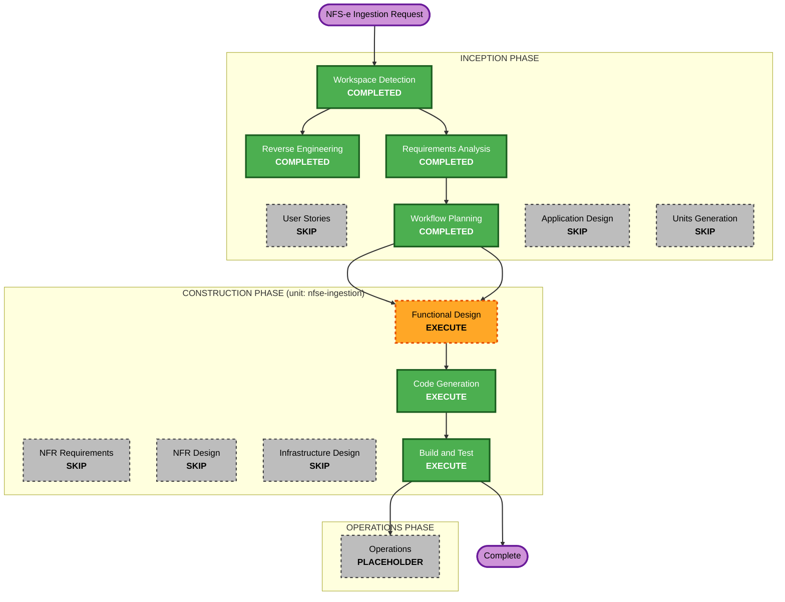

# Execution Plan — Automated NFS-e Ingestion & Extraction

## Detailed Analysis Summary

### Transformation Scope (Brownfield)
- **Transformation Type**: Single feature, additive — composition of existing components + one new local service.
- **Primary Changes**: New `nfse-ingest` DSL definition; new mock NFS-e API (Compose service); Edge Function whitelist + frontend trigger registration; activation seed/migration; new frontend results page; Temporal Schedule bootstrap.
- **Related Components**: Temporal worker (definition only; activities reused), Supabase (seed + whitelist; **no table schema change**), frontend (one JSON page + registry entry), docker-compose (one new service), scripts (schedule bootstrap).

### Change Impact Assessment
- **User-facing changes**: Yes — a results screen + "Scan now" button.
- **Structural changes**: No — reuses existing architecture and the DSL engine.
- **Data model changes**: No schema change — reuses `workflow_document_extractions`. Only data (seed to activate the definition).
- **API changes**: Yes — new mock API endpoints; Edge Function `TRIGGERABLE_DEFINITIONS` gains `nfse-ingest`.
- **NFR impact**: Yes — existing security posture preserved; bounded automatic load (15s + dedup + sequential for_each + Schedule overlap=SKIP). All AI-DLC extensions disabled (PoC).

### Component Relationships
- **Primary Component**: Temporal worker — `nfse-ingest` DSL definition (reuses `http_request`, `file_extract`, `llm_agent`, `supabase_mutate`).
- **Supporting Components**: mock NFS-e API (new), Supabase (seed + Edge whitelist), frontend (results page + trigger registry), scripts (schedule bootstrap).
- **Dependent Components**: results screen depends on `workflow_document_extractions` rows produced by the worker.

### Risk Assessment
- **Risk Level**: Low-Medium.
- **Rollback Complexity**: Easy — remove the definition row/seed, the compose service, the frontend page, and the whitelist entry; no destructive migrations.
- **Testing Complexity**: Moderate — cross-service path (Edge → worker → mock API → LLM → DB → UI), but each piece is small and reused.

## Workflow Visualization



### Text Alternative (always included)
```
INCEPTION
- Workspace Detection ....... COMPLETED
- Reverse Engineering ....... COMPLETED
- Requirements Analysis ..... COMPLETED
- User Stories .............. SKIP
- Workflow Planning ......... COMPLETED (this stage)
- Application Design ........ SKIP
- Units Generation .......... SKIP
CONSTRUCTION (single unit: nfse-ingestion)
- Functional Design ......... EXECUTE
- NFR Requirements .......... SKIP
- NFR Design ................ SKIP
- Infrastructure Design ..... SKIP
- Code Generation ........... EXECUTE
- Build and Test ............ EXECUTE
OPERATIONS
- Operations ................ PLACEHOLDER
```

## Phases to Execute

### 🔵 INCEPTION PHASE
- [x] Workspace Detection (COMPLETED)
- [x] Reverse Engineering (COMPLETED)
- [x] Requirements Analysis (COMPLETED)
- [x] User Stories (SKIPPED)
- [x] Execution Plan (IN PROGRESS)
- [ ] Application Design — **SKIP**
  - **Rationale**: No new high-level component/service-layer design needed beyond what RE + requirements already define; the feature composes existing components + one tiny mock service. Design detail belongs in Functional Design.
- [ ] Units Generation — **SKIP**
  - **Rationale**: Single cohesive unit (`nfse-ingestion`); no multi-unit decomposition or parallel work.

### 🟢 CONSTRUCTION PHASE — unit: `nfse-ingestion`
- [ ] Functional Design — **EXECUTE**
  - **Rationale**: Real design content exists: the `nfse-ingest` DSL workflow shape (list → dedup filter → for_each → extract → upsert), the 19-field NFS-e response schema + BR value normalization, the mock API contract, the dedup rule, low-confidence/content-filter handling, and the results-page data binding.
- [ ] NFR Requirements — **SKIP**
  - **Rationale**: NFRs already determined in `requirements.md` (NFR-SEC/PERF/MAINT/OBS/COMPAT); no new tech-stack selection (full reuse); all extensions disabled.
- [ ] NFR Design — **SKIP**
  - **Rationale**: NFR Requirements skipped; the few NFR mechanics (Schedule overlap=SKIP, sequential for_each, gitignored secret) are captured in Functional Design / Code Generation.
- [ ] Infrastructure Design — **SKIP**
  - **Rationale**: Local-only additive infra (one Docker Compose service + a Temporal Schedule bootstrap script); no cloud/deployment-architecture mapping. Handled in the Code Generation plan.
- [ ] Code Generation — **EXECUTE** (ALWAYS)
  - **Rationale**: Implement the definition, mock API, seed/whitelist, schedule bootstrap, results page, env wiring, and tests.
- [ ] Build and Test — **EXECUTE** (ALWAYS)
  - **Rationale**: Build the stack, run the focused example-based tests, and verify end-to-end (`make verify` + a live ingest run visible in UI/DB).

### 🟡 OPERATIONS PHASE
- [ ] Operations — PLACEHOLDER (out of scope; local POC).

## Package / Change Sequence (Brownfield)
1. **Supabase**: seed/migration to activate `nfse-ingest` definition (`is_active=true`); confirm `workflow_document_extractions` (no schema change).
2. **Mock NFS-e API**: new Compose service serving `docs/examples/` PDFs (`/invoices`, `/invoices/:id/content`).
3. **Temporal worker**: add `temporal/definitions/nfse-ingest.json`; env wiring for Azure + source base URL; (any tiny helper only if the DSL can't express listing/dedup).
4. **Edge Function**: add `nfse-ingest` to `TRIGGERABLE_DEFINITIONS`.
5. **Schedule bootstrap**: script to create the Temporal Schedule (every 15s, overlap=SKIP) at `make up`.
6. **Frontend**: results page (JSON) + route + registry entry for manual "Scan now".
7. **Tests**: worker contract/unit, integration (1 row persisted), edge whitelist, frontend results page.

## Estimated Timeline
- **Total stages remaining**: 3 (Functional Design, Code Generation, Build & Test).
- **Estimated effort**: ~half a day of agent work (POC scope), aligned to the lab's ~90-min Session 2 budget for the core path.

## Success Criteria
- **Primary Goal**: NFS-e are fetched automatically, extracted by Azure gpt-5.4 inside a durable Temporal workflow, persisted to Supabase, and shown on screen — no manual paste/upload.
- **Key Deliverables**: `nfse-ingest` definition (active), mock API, Schedule + scan, results page, tests.
- **Quality Gates**: `make verify` passes; a live scan produces rows in `workflow_document_extractions` visible on the results screen and as a workflow run in the Temporal UI; dedup prevents duplicates; example-based tests green.
- **Integration Testing**: Edge → worker → mock API → LLM → DB → UI path proven over the wire.
