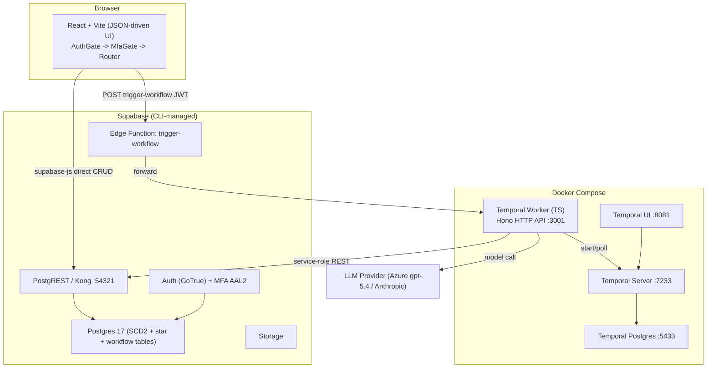
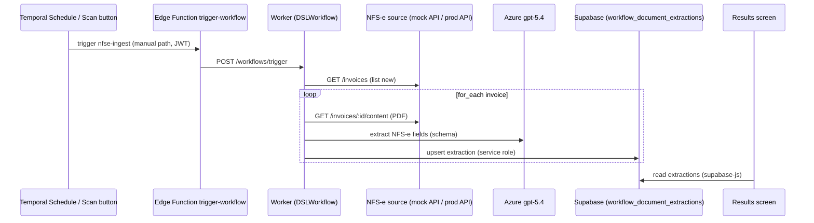

# System Architecture

## System Overview

A multi-service local-first stack: a React/Vite frontend, a Supabase backend (Postgres source of truth, CLI-managed), a TypeScript Temporal worker running JSON-DSL workflows, and the Temporal server/UI. Two paths reach the one source of truth: **direct CRUD** (frontend → Supabase via supabase-js) for everyday data, and **Edge Function + Temporal** for durable/agentic work. Kubernetes/Helm deployment exists but is placeholdered; the feature targets the local stack.

## Architecture Diagram

## Component Descriptions

### Frontend — `frontend/`
- **Purpose**: JSON-driven UI; trigger + observe workflows; browse SCD2 data.
- **Responsibilities**: Auth/MFA gating, page rendering engine, Supabase reads, workflow trigger/detail.
- **Dependencies**: Supabase (anon key), Edge Function, worker HTTP API.
- **Type**: Application.

### Supabase — `supabase/`
- **Purpose**: Source of truth + security boundary.
- **Responsibilities**: schema/migrations, auth/MFA, role-guarded RPCs, read query surfaces, Edge Functions.
- **Dependencies**: none (foundation).
- **Type**: Application/Data.

### Temporal Worker — `temporal/`
- **Purpose**: Durable workflow execution + activities.
- **Responsibilities**: DSL interpretation, activities (LLM/file/HTTP/Supabase/vector), execution tracking, HTTP trigger+query API.
- **Dependencies**: Temporal server, Supabase (service role), LLM provider.
- **Type**: Application.

### Temporal Server/UI/DB — compose services
- **Purpose**: Orchestration backbone + observability.
- **Type**: Infrastructure.

### GitHub Factory — `.github/`
- **Purpose**: Autonomous issue-to-merge (governance, not runtime).
- **Type**: Infrastructure/Tooling.

## Data Flow — NFS-e ingestion (target feature) and existing trigger path

## Integration Points
- **External APIs**: LLM providers (Azure OpenAI primary for this feature); Exa Search (optional, web tools). **New**: an NFS-e source API (mock locally; real API in prod).
- **Databases**: Supabase Postgres (app data); Temporal Postgres (workflow history).
- **Third-party Services**: Temporal (orchestration).

## Infrastructure Components
- **Local**: Supabase CLI + Docker Compose (`temporal-db`, `temporal`, `temporal-ui`, `temporal-worker`, `frontend`); optional Traefik HTTPS overlay.
- **Deployment Model (placeholdered)**: Helm charts (app/temporal/postgres/supabase), AKS/EKS, OpenBao + External Secrets Operator, image signing/SBOM/SLSA in CI. **Out of scope** for this feature (local only).
- **Networking**: worker reaches host Supabase via `host.docker.internal:54321`; browser via `localhost:54321`.
