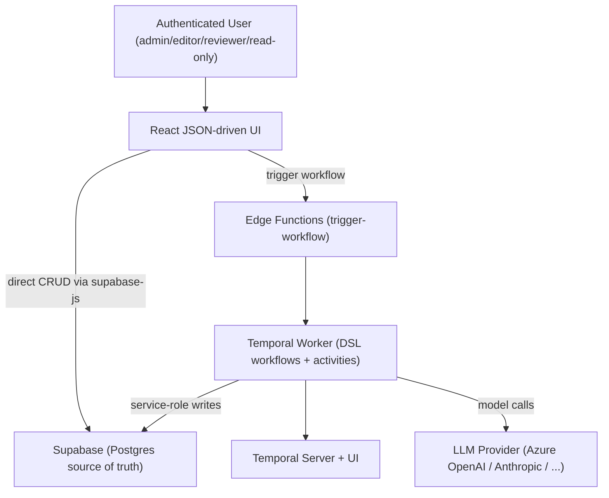

# Business Overview

## Business Context Diagram

## Business Description

- **Business Description**: This repository is the **"10x Application Template"** — a config-first full-stack platform for building data + agentic applications. Its purpose is to let teams stand up an application where **the app's logic lives in data** (a modular SCD2 entity model + a star schema) and **long-running / agentic work runs as durable Temporal workflows defined declaratively as JSON** (a DSL), rather than as bespoke code per feature. It ships with a security-hardened Supabase backend, a JSON-driven React UI, and an autonomous "software factory" (GitHub agents) for issue-to-merge automation.
- **Business Transactions** (what the system does end-to-end):
  1. **Authenticate & enforce MFA** — sign in, enroll/verify TOTP (AAL2), role-based capabilities.
  2. **Record domain data (SCD2)** — create/update entities with full version history via `create_entity_with_version` RPC.
  3. **Browse domain data** — JSON-defined list/detail pages query Supabase directly (TanStack Query).
  4. **Author & promote a workflow definition** — draft a DSL definition, submit → approve (review gate) → activate.
  5. **Trigger a workflow** — UI → Edge Function (whitelist + JWT) → worker HTTP API → durable `DSLWorkflow`.
  6. **Run durable, agentic work** — activities call LLMs, fetch/parse documents, query/mutate Supabase, with retries and step tracing.
  7. **Observe executions** — execution list + detail screens poll curated read RPCs and the Temporal UI.
- **Business Dictionary**:
  - **Entity / Version (SCD2)**: a thing and its immutable, time-windowed snapshots (`is_current`, `valid_from/valid_to`).
  - **Fact / Time-series point**: numeric measurements about entities (star schema).
  - **Workflow Definition**: a declarative JSON (DSL) describing steps; promoted via review gate; one active version per name.
  - **Workflow Execution / Step**: a durable run and its per-step trace.
  - **Activity**: a side-effecting unit (LLM call, HTTP fetch, DB mutate) invoked by a workflow step.
  - **DSL**: the JSON workflow language (sequence, for_each, condition, parallel, try_catch, child_workflow, signals…).

## Component Level Business Descriptions

### Frontend (React/Vite, JSON-driven UI)
- **Purpose**: Present data and let users trigger/observe workflows without bespoke per-page code.
- **Responsibilities**: Auth/MFA gating, JSON page rendering, direct Supabase reads, workflow trigger + execution views.

### Supabase (Postgres + PostgREST + Auth + Storage + Edge Functions)
- **Purpose**: Single source of truth and security boundary.
- **Responsibilities**: Schema (entities/SCD2 + star + workflow tables), auth/MFA, role-guarded write RPCs, read query surfaces, Edge Function trigger entrypoint.

### Temporal Worker (TypeScript)
- **Purpose**: Execute durable workflows and their activities (the "heavy lifting" / agentic tier).
- **Responsibilities**: Interpret DSL definitions, run activities (LLM, file/HTTP, Supabase mutate, vector search), track executions, expose an HTTP API to trigger + query.

### GitHub Factory (.github)
- **Purpose**: Autonomous issue-to-merge software development (out of scope for the NFS-e feature, but governs how PRs are reviewed/merged).
- **Responsibilities**: 26 Copilot-SDK agents across scheduled pipelines; PR validation, security/DB/platform review gates, ADR enforcement.
