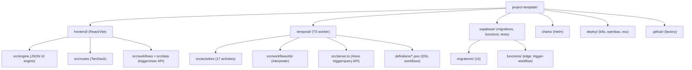

# Code Structure

## Build System
- **Type**: npm workspaces-style multi-package (no single monorepo tool): `frontend/` (npm) + `temporal/` (npm); `supabase/` (Supabase CLI + SQL); `charts/` (Helm); orchestrated by a root `Makefile` (`DOCKER_BUILDKIT=0`).
- **Configuration**: `docker-compose.yml` (+ `.dev.yml`, `.proxy.yml`), `Makefile`, `supabase/config.toml`, per-package `package.json` + `tsconfig*.json` + `biome.json`.

## Module Hierarchy (high level)

## Existing Files Inventory (candidates relevant to the NFS-e feature)

**Temporal worker (`temporal/`):**
- `src/worker.ts` — registers all activities + `workflowsPath`; starts the HTTP API. **(modify: nothing structural; new activities auto-spread if added)**
- `src/server.ts` — Hono API: `POST /workflows/trigger`, execution list/detail, `/health`. **(reference; trigger entrypoint)**
- `src/config.ts` — env-driven config (Temporal, Supabase, `PIAGENT_PROVIDER/MODEL_ID`).
- `src/azure_openai.ts` — Azure env normalization + deployment resolution (Chat Completions path).
- `src/activities/llm_agent.ts` — multi-provider LLM call (schema-enforced). **(reuse)**
- `src/activities/file_extract.ts` — fetch URL + parse PDF/DOCX/XLSX/HTML; optional inline extraction. **(reuse — core to NFS-e)**
- `src/activities/supabase_query.ts` — contains `supabase_mutate` (real write path); `supabase_query` read is a STUB. **(reuse supabase_mutate)**
- `src/activities/http_request.ts` — generic HTTP GET/POST. **(reuse — list invoices)**
- `src/activities/{transform_data,evaluate_decision,execution_tracking,notifications,schedule_trigger,vector_search,web_search,web_crawl,domain_probe,email_send,slack_message,data_validate,supabase_core,llm_embeddings}.ts` — supporting activities (`supabase_core` entity activities are STUBS).
- `src/workflows/dsl/{interpreter,schema,expression,duration,validation}.ts` — the DSL engine. **(reuse, do not fork)**
- `definitions/doc-extraction.json` — skeleton; **superseded** by the new `nfse-ingest` definition (or repurposed). Also: `invoice-processing.json`, `lead-enrichment.json`, `content-moderation.json`, `research-report.json`, classification defs.
- `contract-snapshot.json` — activity/DSL contract snapshot (contract tests).

**Supabase (`supabase/`):**
- `migrations/20260621001000_workflow_document_extractions.sql` — target table. **(reuse; add migration to activate the new definition + seed)**
- `migrations/20260620000200_workflow_dsl_schema.sql` — workflow_definitions/executions/signals.
- `migrations/20260621024000_workflow_execution_query_surface.sql` — read RPCs for UI.
- `functions/trigger-workflow/index.ts` — Edge Function; `TRIGGERABLE_DEFINITIONS` whitelist. **(modify: add `nfse-ingest`)**
- `seed.sql` — placeholder (no auto definition loader). **(modify/seed: activate definition)**

**Frontend (`frontend/`):**
- `src/engine/*` — JSON UI engine (`UIEngine.tsx`, `ComponentRenderer.tsx`, `ExpressionEvaluator.ts`, `useDataSources.ts`, `types.ts`).
- `src/pages/*.json` — page definitions (dashboard, entity-list, entity-detail). **(add: an NFS-e results page JSON)**
- `src/routes/workflows/trigger.tsx`, `routes/workflows/$workflowId.tsx` — trigger + execution detail. **(reuse)**
- `src/workflows/definitions.ts` + `src/workflows/definitions/*.json` — UI workflow registry. **(modify: register nfse-ingest for manual trigger)**
- `src/data/{supabase.ts,workflowApi.ts,queryBuilder.ts}` — data layer. **(reuse)**

## Design Patterns
- **JSON-driven UI (ADR-0018)**: pages as JSON interpreted at runtime; `{{expression}}` binding; Supabase/api/computed data sources.
- **DSL-interpreted workflows (ADR-0001/0006)**: declarative JSON workflows over a fixed activity set; durable execution + step tracing.
- **Provider-neutral LLM adapter (ADR-0008)**: `llm_agent` over `@earendil-works/pi-ai`; schema enforced via mandatory `submit_response` tool.
- **SCD2 versioning (ADR-0021)**: triggers maintain `is_current`/validity windows.
- **Authenticated write path via SECURITY DEFINER RPC (ADR-0023)** + **defense-in-depth auth lockdown/MFA (ADR-0034)**.
- **Static-bundle + runtime env injection (ADR-0031)**: frontend built once, `__VITE_*__` placeholders replaced at container start.

## Critical Dependencies
- **@temporalio/* 1.18.1** — worker/client/workflow/activity runtime (worker compiles to **CommonJS**).
- **@earendil-works/pi-ai 0.79.10** — ESM-only multi-provider LLM client (dynamic-imported).
- **pdf-parse / mammoth / exceljs / cheerio** — document parsing in `file_extract`.
- **@supabase/supabase-js 2.x** — frontend data layer.
- **TanStack Router + Query** — routing + caching/polling.
