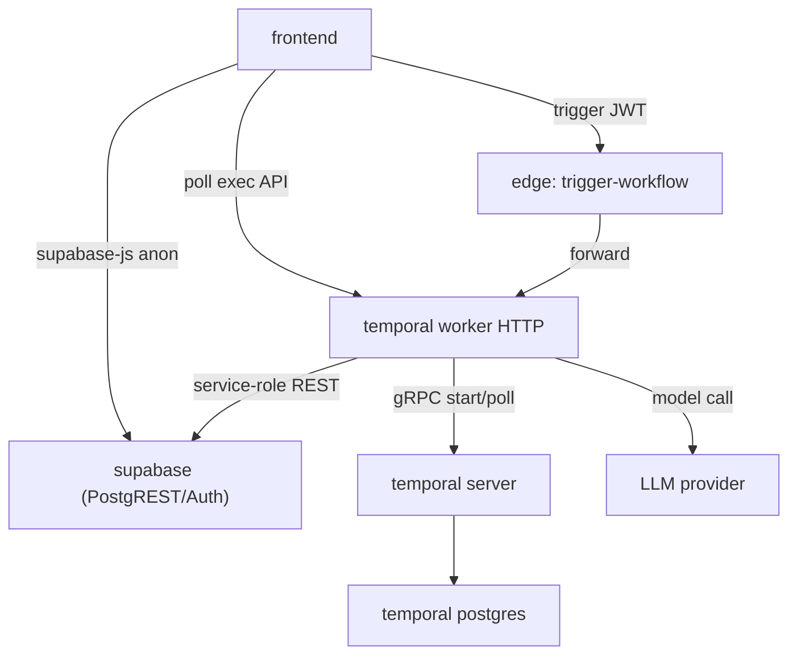

# Dependencies

## Internal Dependencies

### frontend → supabase
- **Type**: Runtime. **Reason**: direct CRUD reads (entities, workflow tables, extractions) via supabase-js + RPC reads.

### frontend → edge function → worker
- **Type**: Runtime. **Reason**: trigger workflows (JWT-validated, whitelisted); poll execution detail from worker HTTP API.

### worker → temporal server
- **Type**: Runtime. **Reason**: start/execute durable workflows; persist history in Temporal Postgres.

### worker → supabase (service role)
- **Type**: Runtime. **Reason**: `supabase_mutate` writes (e.g., `workflow_document_extractions`), execution tracking.

### worker → LLM provider
- **Type**: Runtime. **Reason**: `llm_agent` model calls (Azure gpt-5.4 for this feature).

### workflow_executions → workflow_definitions (FK)
- **Type**: Data. **Reason**: an execution references its active definition (name+version).

## External Dependencies (key)

### @temporalio/* (1.18.1)
- **Purpose**: Temporal worker/client/workflow/activity runtime. **License**: MIT.

### @earendil-works/pi-ai (0.79.10)
- **Purpose**: provider-neutral LLM client (Anthropic/OpenAI/Azure/Bedrock/...). **ESM-only** (dynamic import in CJS worker). **License**: per package (allowlisted by `license-checker`).

### pdf-parse / mammoth / exceljs / cheerio
- **Purpose**: document parsing in `file_extract` (PDF/DOCX/XLSX/HTML). **Relevance**: core to NFS-e PDF→text.

### hono (4) / @hono/node-server
- **Purpose**: worker HTTP API (trigger + query). **License**: MIT.

### @supabase/supabase-js (2.x)
- **Purpose**: frontend data layer (auth, reads, RPC). **License**: MIT.

### TanStack Router / Query
- **Purpose**: routing + caching/polling (execution detail auto-refresh). **License**: MIT.

### pgvector (0.8.2) — optional
- **Purpose**: embeddings + `match_documents`. **Relevance**: not used by NFS-e MVP (Phase 2).

## Dependency / license governance
- `license-checker` runs pre-push (frontend + temporal) with an allowlist (MIT/ISC/Apache-2.0/BSD/etc.).
- `osv-scan` (PR) and nightly CodeQL/semgrep gate vulnerabilities.
