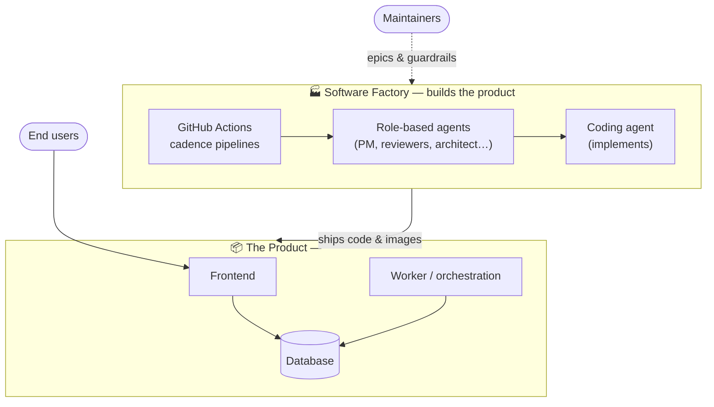
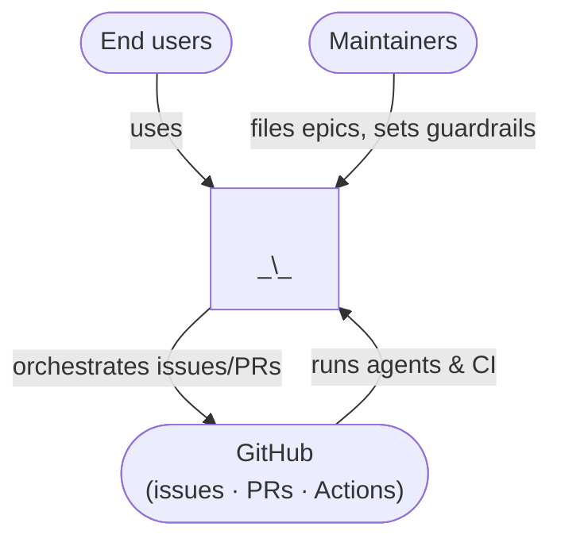
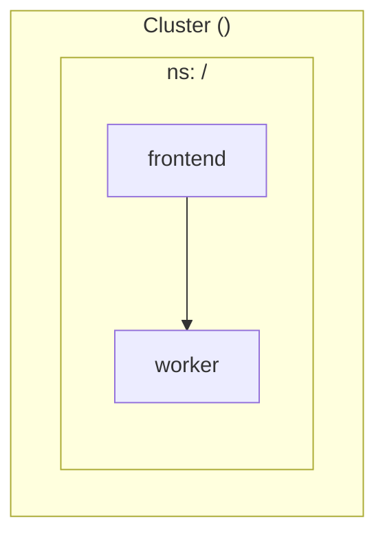

# Architecture Overview

This directory holds the **cross-cutting architecture documentation** for this
project — the diagrams and narrative that tie the subsystems together. It
complements, and does not replace:

- [`docs/adrs/`](../adrs/) — **why** each decision was made (the binding record).
- [`docs/specs/`](../specs/) — the **detailed designs** for individual slices.

Read this when you want the *shape of the whole system*; drop into the ADRs and
specs when you need the depth on a particular decision.

> All diagrams below render natively on GitHub (Mermaid). Replace the placeholder
> labels with your system's real containers, then let each subsystem page go deeper.

## What this system is

This repository ships **a product plus the factory that builds it**:

1. **The product** — _\<one line: what the application does and for whom\>_.
2. **The Software Factory** — GitHub Actions + role-based AI agents (see
   [`.github/agents/`](../../.github/agents/)) that triage, design, build, review,
   and ship the product. Configured via [`.github/factory.yml`](../../.github/factory.yml).
3. _(Optional)_ **The Operations Factory** — scheduled agentic workflows that
   automate back-office operations for the people who use the product.

## C4 Level 1 — System context

## C4 Level 2 — Containers

## The pages

Suggested structure — add or remove pages to match your system:

| Page | What it covers |
|------|----------------|
| [Product architecture](./product-architecture.md) | Frontend, data layer, core workflows |
| [Data model & security](./data-model.md) | Schema, domain graph, access/role model |
| [Network architecture & security](./network-security.md) | Ingress, TLS, NetworkPolicy, Docker Desktop vs AKS/EKS — Mermaid diagrams |
| [Software Factory](./software-factory.md) | Role-based agents, cadence pipelines, issue→PR→merge→deploy lifecycle |
| [CI/CD & delivery pipeline](./ci-cd-pipelines.md) | Workflow catalogue, PR test gate, gated dev→test→prod promotion |
| [Deployment & infrastructure](./deployment.md) | Local stack, cluster/Helm multi-env topology, image promotion, edge |

See each page for the detailed diagrams and file references.
