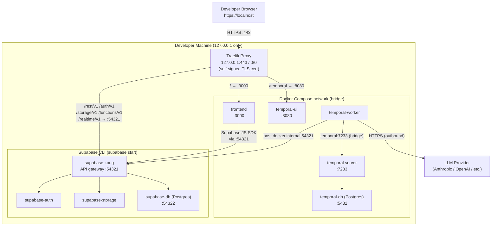
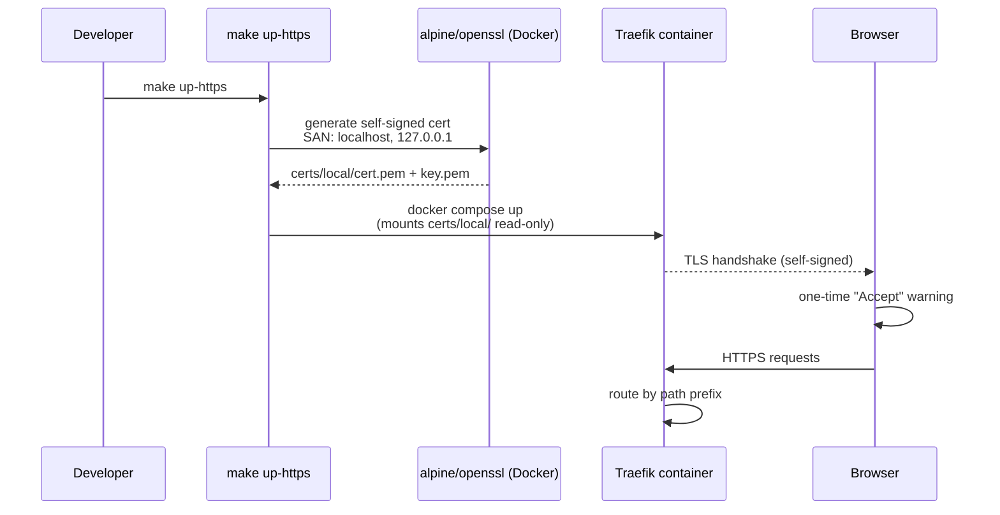
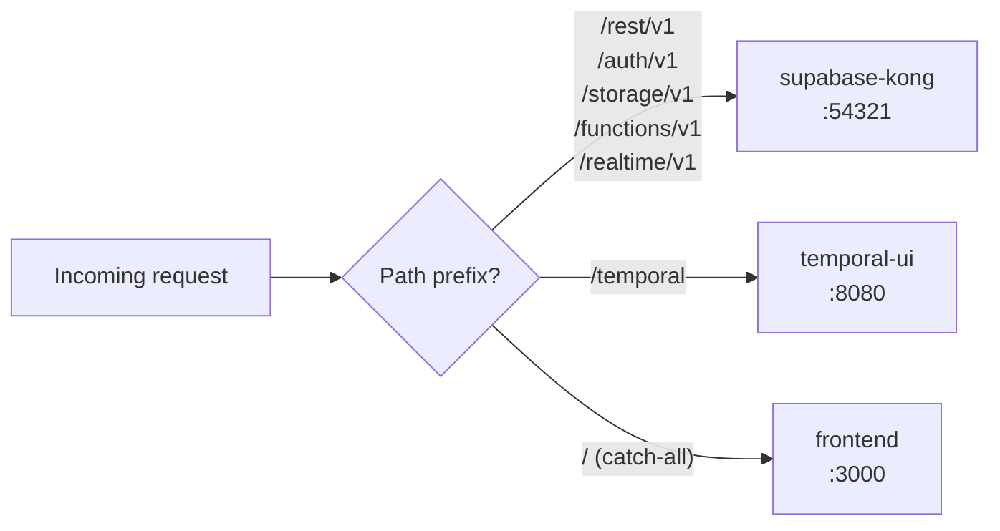
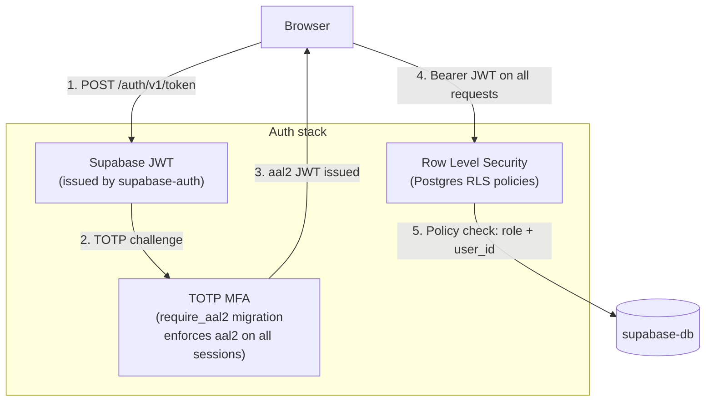
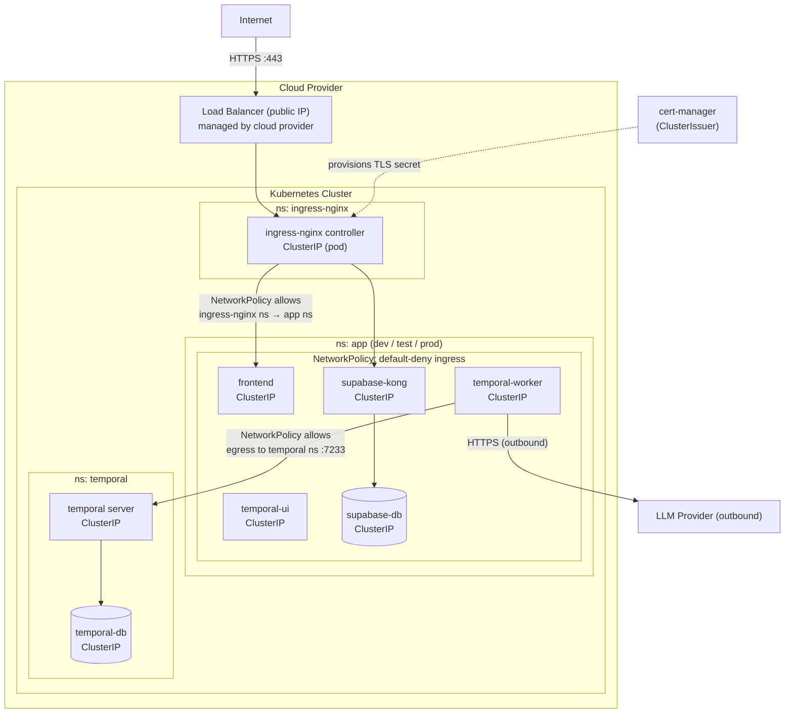
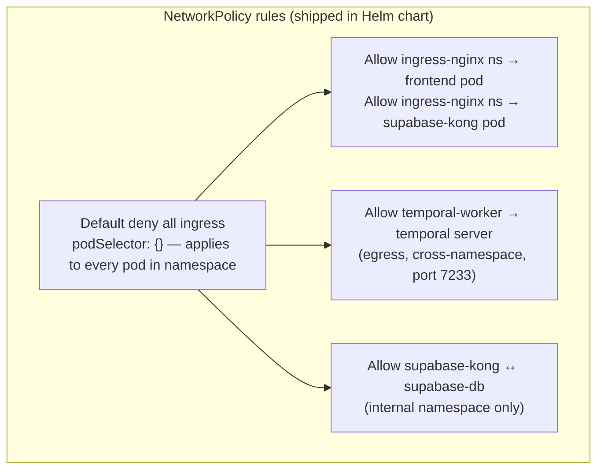
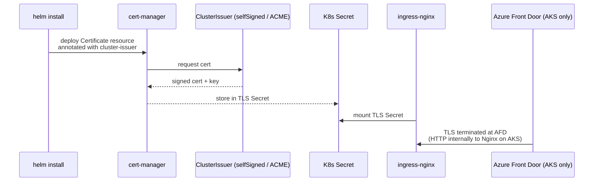
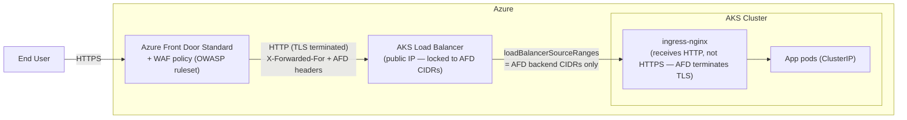
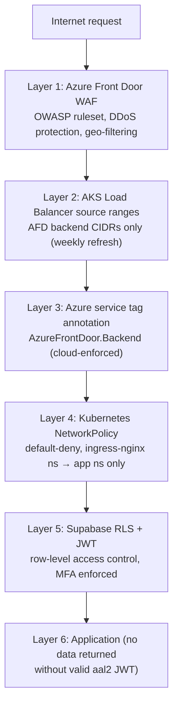

# Network Architecture and Security Posture

This document describes how the stack is wired together at the network level and what controls prevent unauthorised access. Two deployment targets are covered: **Docker Desktop** (local dev) and **Kubernetes** (AKS/EKS or any cloud).

**Related:**
- [ADR-0047 — Network Exposure and Ingress Security Model](../adrs/0047-network-exposure-and-ingress-security-model.md)
- [ADR-0048 — TLS Certificate Strategy](../adrs/0048-tls-certificate-strategy.md)
- [Network Exposure Spec](../specs/network-exposure-spec.md)

---

## Core Principle

> **Nothing is reachable from outside the environment unless it passes through the single controlled ingress point.**

All services default to unexposed (Docker bridge / Kubernetes ClusterIP). A single reverse proxy or ingress controller is the only public listener. This was codified after the `mna-app` incident where services deployed as `LoadBalancer` received public IPs that bypassed Azure Front Door and its WAF.

---

## Docker Desktop

### Service topology



### Port exposure

| Service | Host binding | Accessible from |
|---|---|---|
| Traefik (HTTPS) | `127.0.0.1:443` | Browser only, loopback |
| Traefik (HTTP→HTTPS redirect) | `127.0.0.1:80` | Loopback only |
| frontend | `127.0.0.1:3000` | Loopback (`make up` only, removed in HTTPS overlay) |
| temporal-ui | `127.0.0.1:8081` | Loopback (`make up` only, removed in HTTPS overlay) |
| temporal server | `127.0.0.1:7234` | Loopback (SDK access, not browser) |
| temporal-db | `127.0.0.1:5433` | Loopback (DB tooling only) |
| Supabase API (Kong) | `127.0.0.1:54321` | Loopback (managed by Supabase CLI) |
| Supabase DB | `127.0.0.1:54322` | Loopback (managed by Supabase CLI) |

All bindings use `127.0.0.1`, never `0.0.0.0`. Nothing is reachable from the local network or other machines on the same Wi-Fi.

### TLS and certificate flow



The cert is generated once and cached in `certs/local/` (git-ignored). Delete the directory and re-run `make up-https` to rotate. See ADR-0048 for the optional `mkcert` upgrade to a browser-trusted cert.

### Traffic routing rules



Supabase and Temporal routes have priority 20; the frontend catch-all has priority 1.

### Authentication layers



Supabase Studio is disabled (`enabled = false` in `supabase/config.toml`, `--exclude studio` in `supabase start`). Use `make bootstrap-users` to create dev accounts.

---

## Kubernetes (Generic — AKS, EKS, GKE)

### Cluster network topology



### NetworkPolicy enforcement



NetworkPolicy is enforced only when the cluster's CNI supports it (Calico, Cilium, Azure NPM, AWS VPC CNI with Calico, GKE Dataplane V2). Clusters using `flannel` (e.g. default k3d/kind) silently ignore it — verify your CNI before relying on these policies for security guarantees.

### TLS certificate lifecycle (Kubernetes)



- **Dev/test:** `selfSigned` ClusterIssuer (no external CA required)
- **Production:** `letsencrypt-prod` ClusterIssuer via ACME HTTP-01 or DNS-01
- Switch by changing the `cert-manager.io/cluster-issuer` annotation in `values-*.yaml`

---

## Kubernetes on Azure (AKS + Azure Front Door)

### Traffic path



### AKS-specific service annotation

The Nginx Ingress `LoadBalancer` service in `values-azure.yaml` carries two constraints that block all traffic that does not originate from Azure Front Door's backend nodes:

```yaml
controller:
  service:
    annotations:
      service.beta.kubernetes.io/azure-allowed-service-tags: "AzureFrontDoor.Backend"
    loadBalancerSourceRanges:
      - "4.153.250.0/29"   # example — full list in deploy/azure/afd-backend-cidrs.txt
      # regenerated weekly by pipeline-weekly.yml CI job
```

Even if an attacker learns the raw AKS load balancer IP, their traffic is dropped at the cloud networking layer before reaching any pod.

### Defence-in-depth layers on AKS



---

## What is never publicly exposed

| Service | Risk if exposed | Mitigation |
|---|---|---|
| `temporal-ui` | No auth — full workflow history visible and mutable | ClusterIP; Nginx Ingress with IP-allowlist annotation or VPN-only path |
| `supabase-db` (Postgres) | Direct database access | ClusterIP only, never in ingress |
| `temporal-db` (Postgres) | Direct Temporal state access | ClusterIP only |
| `temporal` server | Workflow control plane | ClusterIP; only worker connects internally |
| Supabase Studio | Admin UI, no auth | Disabled in `supabase/config.toml` (`enabled = false`) and excluded via `--exclude studio` |

---

## Comparison: Docker Desktop vs Kubernetes

| Concern | Docker Desktop | Kubernetes |
|---|---|---|
| Ingress | Traefik container (`docker-compose.proxy.yml`) | ingress-nginx (Helm, one-time per cluster) |
| TLS termination | Traefik (self-signed cert, auto-generated) | cert-manager (selfSigned / Let's Encrypt) |
| External access | `127.0.0.1` bindings — loopback only | ClusterIP default + single LoadBalancer IP |
| Network isolation | Docker bridge (all containers on same network) | Kubernetes NetworkPolicy (default-deny) |
| AKS hardening | N/A | `loadBalancerSourceRanges` + AFD service tag |
| Auth enforcement | Supabase JWT + `require_aal2` migration | Same + RLS |
| Temporal UI protection | Port removed in proxy overlay — only via `/temporal` path | ClusterIP; IP-allowlist annotation recommended |
| Supabase Studio | Disabled (`config.toml` + `--exclude studio`) | Not deployed in production |
