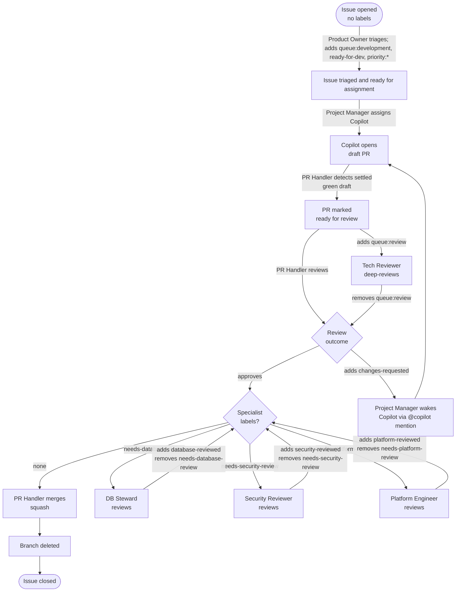

# Software Factory

The Software Factory is a set of scheduled GitHub Actions pipelines that run
role-based AI agents on a fixed cadence. Once the repository secrets and
labels are in place (see
[`FACTORY-ACTIVATION.md`](../../.github/FACTORY-ACTIVATION.md)), no further
configuration is needed — the factory is self-healing and self-scheduling.
Every issue filed in the repository will be triaged, assigned, implemented,
reviewed, and merged entirely by the factory with no human required in the
critical path. Maintainers interact with the factory by filing issues and
setting guardrails; the agents handle the rest.

## The three pipeline cadences

| Pipeline | Schedule | Workflow file | Agents |
|---|---|---|---|
| **Fast** | Every 15 min | [`pipeline-fast.yml`](../../.github/workflows/pipeline-fast.yml) | Stale re-kick → PR Handler → Product Owner → Project Manager → DB Steward* → Security Reviewer* → Platform Engineer* |
| **Hourly** | Every :30 | [`pipeline-hourly.yml`](../../.github/workflows/pipeline-hourly.yml) | Factory Architect → QA Manager → Operations Manager → Cluster Guardian* |
| **Daily** | 06:00 UTC | [`pipeline-daily.yml`](../../.github/workflows/pipeline-daily.yml) | Docs Improver → User Docs Manager |

*conditional: only runs when relevant issues/PRs exist

## Issue-to-merge lifecycle

## Specialist review lanes

The DB Steward, Security Reviewer, and Platform Engineer run conditionally in
the fast pipeline. When a PR carries a `needs-database-review`,
`needs-security-review`, or `needs-platform-review` label, the PR Handler will
not merge it. The relevant specialist agent reviews the PR, removes the
`needs-*-review` label, and adds the corresponding `*-reviewed` label. Only
once all specialist labels are cleared will the PR Handler proceed to merge.

## How work is prioritised

- The Project Manager fills Copilot slots up to `max_open_copilot_prs`
  (configured in [`.github/factory.yml`](../../.github/factory.yml)).
- Work is assigned in priority order: `priority:critical` → `priority:high` →
  `priority:medium` → `priority:low`.

## Key configuration files

| File | Purpose |
|---|---|
| [`.github/factory.yml`](../../.github/factory.yml) | Concurrency limits, runner profiles, stack config |
| [`.github/LABELS.md`](../../.github/LABELS.md) | Full label taxonomy with who sets / who clears |
| [`.github/FACTORY-ACTIVATION.md`](../../.github/FACTORY-ACTIVATION.md) | Secrets checklist and activation verification |
| [`.github/agents/`](../../.github/agents/) | One `.agent.md` per role — the agent's full instruction set |
| [`.github/copilot-instructions.md`](../../.github/copilot-instructions.md) | Rules for the Copilot coding agent |

← [Architecture overview](./README.md)
